<!-- README.md is generated from README.Rmd. Please edit that file -->

# Análise Adriano - Lizandra

## Análise para Macroscópica

``` r
library(tidyverse)
library(readxl)
library(ExpDes.pt)
macroscopia <- read_excel("data/macroscopia.xlsx",na = "NA")
head(macroscopia)
#> # A tibble: 6 x 23
#>   coleta data    trat   rep  peso int_g_peso ileo_peso jejuno_peso duodeno_peso
#>    <dbl> <chr>  <dbl> <dbl> <dbl>      <dbl>     <dbl>       <dbl>        <dbl>
#> 1      1 12_abr     1     1  165.       2.75      0.71        6.99         3.38
#> 2      1 12_abr     1     2  180.       2.6       0.77        7.19         2.39
#> 3      1 12_abr     1     3  179.       2.95      0.84        7.09         2.44
#> 4      1 12_abr     1     4  191.       3.02      0.84        8.79         3.49
#> 5      1 12_abr     1     5  210.       2.55      0.71        7.1          2.88
#> 6      1 12_abr     1     6  144.       2.29      0.77        5.42         1.97
#> # ... with 14 more variables: pancreas_peso <dbl>, mc_peso <dbl>,
#> #   msc_peso <dbl>, pv_peso <dbl>, baco_peso <dbl>, rim_peso <dbl>,
#> #   fig_vis_peso <dbl>, int_g_comp <dbl>, ileo_comp <dbl>, jejuno_comp <dbl>,
#> #   duodeno_comp <dbl>, rim_1_cop <dbl>, rim_1_esp <dbl>, pv_esp <dbl>
```

### Coleta 01

``` r
dados <- macroscopia %>% 
  filter(coleta==1)

for( i in 5:length(macroscopia)){
  variavel <- names(macroscopia[i])
  df <- dados %>% 
    select(data,trat,variavel)
  names(df) <- c("data","trat","y")
  plot_1 <- df %>% 
  group_by(data, trat) %>% 
  ggplot(aes(y=y, x= as.factor(trat), fill=as.factor(trat))) +
  geom_boxplot() +
  facet_wrap(~data)+
  theme_bw() +
  labs(x="Tratamentos", y=variavel)+
  theme(legend.position="none")
  print(plot_1)
  dia <- df %>% pull(data)
  trat <- df %>% pull(trat)
  y <- df %>%  pull(y)
  fat2.dic(dia, trat, y, fac.names = c("Dia","Trat"))
}
```

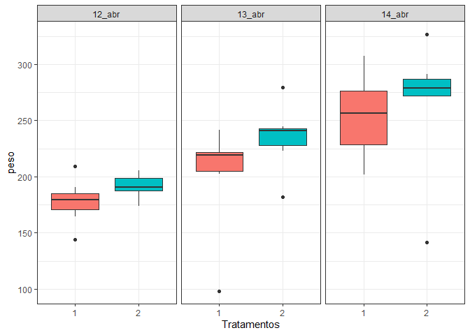<!-- -->

    #> ------------------------------------------------------------------------
    #> Legenda:
    #> FATOR 1:  Dia 
    #> FATOR 2:  Trat 
    #> ------------------------------------------------------------------------
    #> 
    #> 
    #> Quadro da analise de variancia
    #> ------------------------------------------------------------------------
    #>          GL    SQ QM      Fc   Pr>Fc
    #> Dia       2 39748  3 14.1333 0.00003
    #> Trat      1  4144  4  2.9473 0.09462
    #> Dia*Trat  2   922  5  0.3278 0.72262
    #> Residuo  36 50622  2                
    #> Total    41 95436  1                
    #> ------------------------------------------------------------------------
    #> CV = 16.97 %
    #> 
    #> ------------------------------------------------------------------------
    #> Teste de normalidade dos residuos (Shapiro-Wilk)
    #> valor-p:  6.976853e-05 
    #> ATENCAO: a 5% de significancia, os residuos nao podem ser considerados normais!
    #> ------------------------------------------------------------------------
    #> 
    #> Interacao nao significativa: analisando os efeitos simples
    #> ------------------------------------------------------------------------
    #> Dia
    #> Teste de Tukey
    #> ------------------------------------------------------------------------
    #> Grupos Tratamentos Medias
    #> a     14_abr      260.0129 
    #>  b    13_abr      218.2421 
    #>  b    12_abr      184.8129 
    #> ------------------------------------------------------------------------
    #> 
    #> Trat
    #> De acordo com o teste F, as medias desse fator sao estatisticamente iguais.
    #> ------------------------------------------------------------------------
    #>   Niveis   Medias
    #> 1      1 211.0890
    #> 2      2 230.9562
    #> ------------------------------------------------------------------------

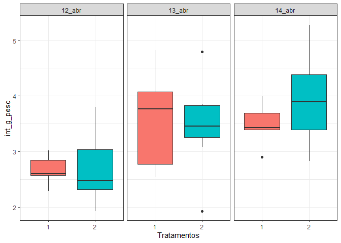<!-- -->

    #> ------------------------------------------------------------------------
    #> Legenda:
    #> FATOR 1:  Dia 
    #> FATOR 2:  Trat 
    #> ------------------------------------------------------------------------
    #> 
    #> 
    #> Quadro da analise de variancia
    #> ------------------------------------------------------------------------
    #>          GL      SQ QM     Fc   Pr>Fc
    #> Dia       2  8.2656  5 8.5358 0.00092
    #> Trat      1  0.1840  2 0.3800 0.54146
    #> Dia*Trat  2  0.5156  3 0.5325 0.59171
    #> Residuo  36 17.4303  4               
    #> Total    41 26.3956  1               
    #> ------------------------------------------------------------------------
    #> CV = 21.04 %
    #> 
    #> ------------------------------------------------------------------------
    #> Teste de normalidade dos residuos (Shapiro-Wilk)
    #> valor-p:  0.62849 
    #> De acordo com o teste de Shapiro-Wilk a 5% de significancia, os residuos podem ser considerados normais.
    #> ------------------------------------------------------------------------
    #> 
    #> Interacao nao significativa: analisando os efeitos simples
    #> ------------------------------------------------------------------------
    #> Dia
    #> Teste de Tukey
    #> ------------------------------------------------------------------------
    #> Grupos Tratamentos Medias
    #> a     14_abr      3.717857 
    #> a     13_abr      3.513571 
    #>  b    12_abr      2.691429 
    #> ------------------------------------------------------------------------
    #> 
    #> Trat
    #> De acordo com o teste F, as medias desse fator sao estatisticamente iguais.
    #> ------------------------------------------------------------------------
    #>   Niveis   Medias
    #> 1      1 3.241429
    #> 2      2 3.373810
    #> ------------------------------------------------------------------------

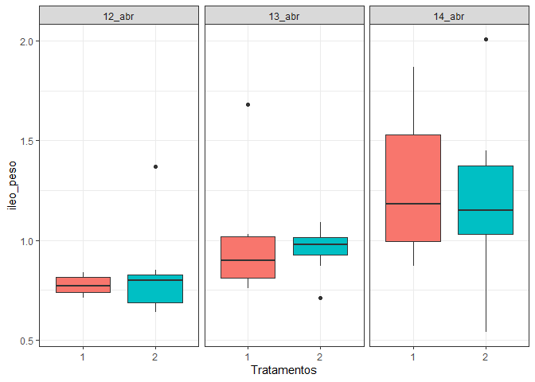<!-- -->

    #> ------------------------------------------------------------------------
    #> Legenda:
    #> FATOR 1:  Dia 
    #> FATOR 2:  Trat 
    #> ------------------------------------------------------------------------
    #> 
    #> 
    #> Quadro da analise de variancia
    #> ------------------------------------------------------------------------
    #>          GL     SQ QM     Fc   Pr>Fc
    #> Dia       2 1.4057  5 8.0260 0.00131
    #> Trat      1 0.0038  2 0.0435 0.83596
    #> Dia*Trat  2 0.0310  3 0.1769 0.83855
    #> Residuo  36 3.1527  4               
    #> Total    41 4.5932  1               
    #> ------------------------------------------------------------------------
    #> CV = 29.31 %
    #> 
    #> ------------------------------------------------------------------------
    #> Teste de normalidade dos residuos (Shapiro-Wilk)
    #> valor-p:  0.003158621 
    #> ATENCAO: a 5% de significancia, os residuos nao podem ser considerados normais!
    #> ------------------------------------------------------------------------
    #> 
    #> Interacao nao significativa: analisando os efeitos simples
    #> ------------------------------------------------------------------------
    #> Dia
    #> Teste de Tukey
    #> ------------------------------------------------------------------------
    #> Grupos Tratamentos Medias
    #> a     14_abr      1.248571 
    #> ab    13_abr      0.9757143 
    #>  b    12_abr      0.8042857 
    #> ------------------------------------------------------------------------
    #> 
    #> Trat
    #> De acordo com o teste F, as medias desse fator sao estatisticamente iguais.
    #> ------------------------------------------------------------------------
    #>   Niveis   Medias
    #> 1      1 1.019048
    #> 2      2 1.000000
    #> ------------------------------------------------------------------------

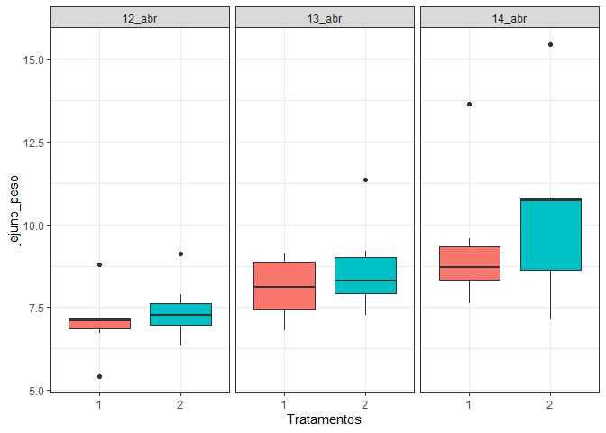<!-- -->

    #> ------------------------------------------------------------------------
    #> Legenda:
    #> FATOR 1:  Dia 
    #> FATOR 2:  Trat 
    #> ------------------------------------------------------------------------
    #> 
    #> 
    #> Quadro da analise de variancia
    #> ------------------------------------------------------------------------
    #>          GL      SQ QM     Fc   Pr>Fc
    #> Dia       2  47.077  4 9.0418 0.00066
    #> Trat      1   4.352  5 1.6718 0.20426
    #> Dia*Trat  2   0.663  2 0.1272 0.88091
    #> Residuo  36  93.718  3               
    #> Total    41 145.810  1               
    #> ------------------------------------------------------------------------
    #> CV = 19.04 %
    #> 
    #> ------------------------------------------------------------------------
    #> Teste de normalidade dos residuos (Shapiro-Wilk)
    #> valor-p:  0.0007324651 
    #> ATENCAO: a 5% de significancia, os residuos nao podem ser considerados normais!
    #> ------------------------------------------------------------------------
    #> 
    #> Interacao nao significativa: analisando os efeitos simples
    #> ------------------------------------------------------------------------
    #> Dia
    #> Teste de Tukey
    #> ------------------------------------------------------------------------
    #> Grupos Tratamentos Medias
    #> a     14_abr      9.812857 
    #> ab    13_abr      8.382857 
    #>  b    12_abr      7.224286 
    #> ------------------------------------------------------------------------
    #> 
    #> Trat
    #> De acordo com o teste F, as medias desse fator sao estatisticamente iguais.
    #> ------------------------------------------------------------------------
    #>   Niveis   Medias
    #> 1      1 8.151429
    #> 2      2 8.795238
    #> ------------------------------------------------------------------------

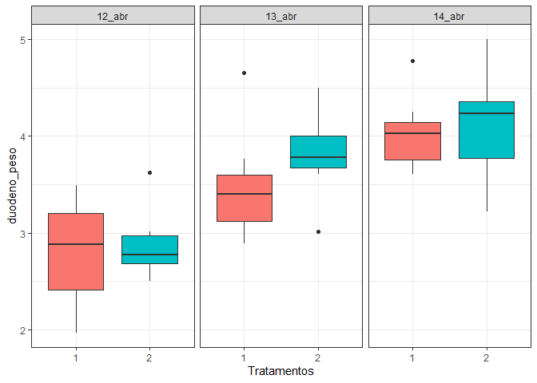<!-- -->

    #> ------------------------------------------------------------------------
    #> Legenda:
    #> FATOR 1:  Dia 
    #> FATOR 2:  Trat 
    #> ------------------------------------------------------------------------
    #> 
    #> 
    #> Quadro da analise de variancia
    #> ------------------------------------------------------------------------
    #>          GL      SQ QM      Fc   Pr>Fc
    #> Dia       2 10.8316  5 21.7213 0.00000
    #> Trat      1  0.2736  4  1.0974 0.30182
    #> Dia*Trat  2  0.1399  2  0.2806 0.75694
    #> Residuo  36  8.9759  3                
    #> Total    41 20.2211  1                
    #> ------------------------------------------------------------------------
    #> CV = 14.19 %
    #> 
    #> ------------------------------------------------------------------------
    #> Teste de normalidade dos residuos (Shapiro-Wilk)
    #> valor-p:  0.4687477 
    #> De acordo com o teste de Shapiro-Wilk a 5% de significancia, os residuos podem ser considerados normais.
    #> ------------------------------------------------------------------------
    #> 
    #> Interacao nao significativa: analisando os efeitos simples
    #> ------------------------------------------------------------------------
    #> Dia
    #> Teste de Tukey
    #> ------------------------------------------------------------------------
    #> Grupos Tratamentos Medias
    #> a     14_abr      4.066429 
    #> a     13_abr      3.645 
    #>  b    12_abr      2.842143 
    #> ------------------------------------------------------------------------
    #> 
    #> Trat
    #> De acordo com o teste F, as medias desse fator sao estatisticamente iguais.
    #> ------------------------------------------------------------------------
    #>   Niveis   Medias
    #> 1      1 3.437143
    #> 2      2 3.598571
    #> ------------------------------------------------------------------------

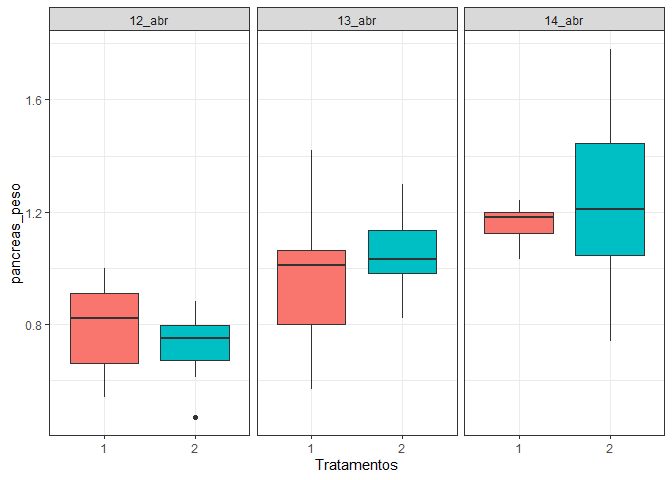<!-- -->

    #> ------------------------------------------------------------------------
    #> Legenda:
    #> FATOR 1:  Dia 
    #> FATOR 2:  Trat 
    #> ------------------------------------------------------------------------
    #> 
    #> 
    #> Quadro da analise de variancia
    #> ------------------------------------------------------------------------
    #>          GL      SQ QM      Fc   Pr>Fc
    #> Dia       2 1.41773  5 15.5469 0.00001
    #> Trat      1 0.01486  2  0.3259 0.57163
    #> Dia*Trat  2 0.05768  3  0.6325 0.53707
    #> Residuo  36 1.64143  4                
    #> Total    41 3.13170  1                
    #> ------------------------------------------------------------------------
    #> CV = 21.64 %
    #> 
    #> ------------------------------------------------------------------------
    #> Teste de normalidade dos residuos (Shapiro-Wilk)
    #> valor-p:  0.5814811 
    #> De acordo com o teste de Shapiro-Wilk a 5% de significancia, os residuos podem ser considerados normais.
    #> ------------------------------------------------------------------------
    #> 
    #> Interacao nao significativa: analisando os efeitos simples
    #> ------------------------------------------------------------------------
    #> Dia
    #> Teste de Tukey
    #> ------------------------------------------------------------------------
    #> Grupos Tratamentos Medias
    #> a     14_abr      1.200714 
    #> a     13_abr      1.007857 
    #>  b    12_abr      0.7521429 
    #> ------------------------------------------------------------------------
    #> 
    #> Trat
    #> De acordo com o teste F, as medias desse fator sao estatisticamente iguais.
    #> ------------------------------------------------------------------------
    #>   Niveis    Medias
    #> 1      1 0.9680952
    #> 2      2 1.0057143
    #> ------------------------------------------------------------------------

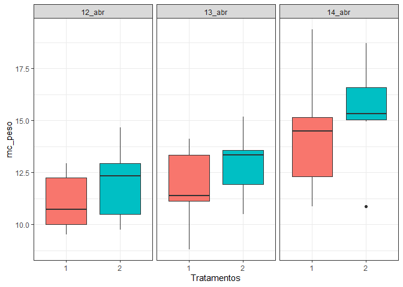<!-- -->

    #> ------------------------------------------------------------------------
    #> Legenda:
    #> FATOR 1:  Dia 
    #> FATOR 2:  Trat 
    #> ------------------------------------------------------------------------
    #> 
    #> 
    #> Quadro da analise de variancia
    #> ------------------------------------------------------------------------
    #>          GL      SQ QM     Fc   Pr>Fc
    #> Dia       2  83.049  5 9.7781 0.00041
    #> Trat      1  10.741  3 2.5294 0.12049
    #> Dia*Trat  2   0.255  2 0.0300 0.97047
    #> Residuo  36 152.880  4               
    #> Total    41 246.925  1               
    #> ------------------------------------------------------------------------
    #> CV = 15.96 %
    #> 
    #> ------------------------------------------------------------------------
    #> Teste de normalidade dos residuos (Shapiro-Wilk)
    #> valor-p:  0.9807559 
    #> De acordo com o teste de Shapiro-Wilk a 5% de significancia, os residuos podem ser considerados normais.
    #> ------------------------------------------------------------------------
    #> 
    #> Interacao nao significativa: analisando os efeitos simples
    #> ------------------------------------------------------------------------
    #> Dia
    #> Teste de Tukey
    #> ------------------------------------------------------------------------
    #> Grupos Tratamentos Medias
    #> a     14_abr      14.84286 
    #>  b    13_abr      12.37714 
    #>  b    12_abr      11.52714 
    #> ------------------------------------------------------------------------
    #> 
    #> Trat
    #> De acordo com o teste F, as medias desse fator sao estatisticamente iguais.
    #> ------------------------------------------------------------------------
    #>   Niveis   Medias
    #> 1      1 12.41000
    #> 2      2 13.42143
    #> ------------------------------------------------------------------------

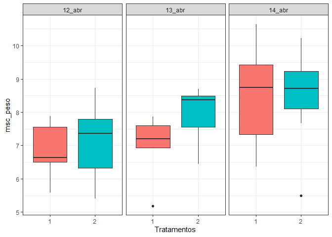<!-- -->

    #> ------------------------------------------------------------------------
    #> Legenda:
    #> FATOR 1:  Dia 
    #> FATOR 2:  Trat 
    #> ------------------------------------------------------------------------
    #> 
    #> 
    #> Quadro da analise de variancia
    #> ------------------------------------------------------------------------
    #>          GL     SQ QM     Fc   Pr>Fc
    #> Dia       2 15.369  5 5.5845 0.00772
    #> Trat      1  1.382  4 1.0047 0.32287
    #> Dia*Trat  2  1.597  2 0.5803 0.56487
    #> Residuo  36 49.538  3               
    #> Total    41 67.886  1               
    #> ------------------------------------------------------------------------
    #> CV = 15.34 %
    #> 
    #> ------------------------------------------------------------------------
    #> Teste de normalidade dos residuos (Shapiro-Wilk)
    #> valor-p:  0.166831 
    #> De acordo com o teste de Shapiro-Wilk a 5% de significancia, os residuos podem ser considerados normais.
    #> ------------------------------------------------------------------------
    #> 
    #> Interacao nao significativa: analisando os efeitos simples
    #> ------------------------------------------------------------------------
    #> Dia
    #> Teste de Tukey
    #> ------------------------------------------------------------------------
    #> Grupos Tratamentos Medias
    #> a     14_abr      8.454286 
    #> ab    13_abr      7.492857 
    #>  b    12_abr      6.997143 
    #> ------------------------------------------------------------------------
    #> 
    #> Trat
    #> De acordo com o teste F, as medias desse fator sao estatisticamente iguais.
    #> ------------------------------------------------------------------------
    #>   Niveis   Medias
    #> 1      1 7.466667
    #> 2      2 7.829524
    #> ------------------------------------------------------------------------

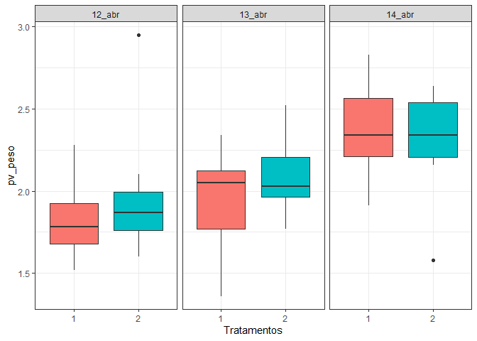<!-- -->

    #> ------------------------------------------------------------------------
    #> Legenda:
    #> FATOR 1:  Dia 
    #> FATOR 2:  Trat 
    #> ------------------------------------------------------------------------
    #> 
    #> 
    #> Quadro da analise de variancia
    #> ------------------------------------------------------------------------
    #>          GL     SQ QM     Fc   Pr>Fc
    #> Dia       2 1.3758  5 6.0657 0.00537
    #> Trat      1 0.0672  2 0.5926 0.44645
    #> Dia*Trat  2 0.1393  3 0.6140 0.54676
    #> Residuo  36 4.0826  4               
    #> Total    41 5.6648  1               
    #> ------------------------------------------------------------------------
    #> CV = 16.15 %
    #> 
    #> ------------------------------------------------------------------------
    #> Teste de normalidade dos residuos (Shapiro-Wilk)
    #> valor-p:  0.639612 
    #> De acordo com o teste de Shapiro-Wilk a 5% de significancia, os residuos podem ser considerados normais.
    #> ------------------------------------------------------------------------
    #> 
    #> Interacao nao significativa: analisando os efeitos simples
    #> ------------------------------------------------------------------------
    #> Dia
    #> Teste de Tukey
    #> ------------------------------------------------------------------------
    #> Grupos Tratamentos Medias
    #> a     14_abr      2.334286 
    #>  b    13_abr      2.014286 
    #>  b    12_abr      1.908571 
    #> ------------------------------------------------------------------------
    #> 
    #> Trat
    #> De acordo com o teste F, as medias desse fator sao estatisticamente iguais.
    #> ------------------------------------------------------------------------
    #>   Niveis   Medias
    #> 1      1 2.045714
    #> 2      2 2.125714
    #> ------------------------------------------------------------------------

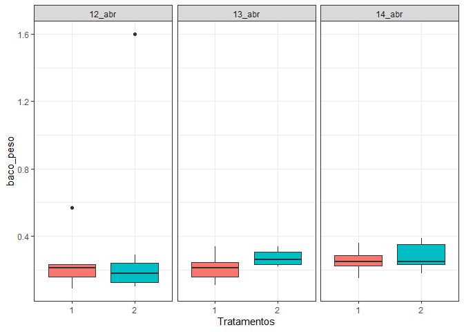<!-- -->

    #> ------------------------------------------------------------------------
    #> Legenda:
    #> FATOR 1:  Dia 
    #> FATOR 2:  Trat 
    #> ------------------------------------------------------------------------
    #> 
    #> 
    #> Quadro da analise de variancia
    #> ------------------------------------------------------------------------
    #>          GL      SQ QM      Fc   Pr>Fc
    #> Dia       2 0.02905  3 0.25617 0.77541
    #> Trat      1 0.05944  5 1.04838 0.31271
    #> Dia*Trat  2 0.02185  2 0.19268 0.82559
    #> Residuo  36 2.04103  4                
    #> Total    41 2.15136  1                
    #> ------------------------------------------------------------------------
    #> CV = 87.88 %
    #> 
    #> ------------------------------------------------------------------------
    #> Teste de normalidade dos residuos (Shapiro-Wilk)
    #> valor-p:  1.230677e-09 
    #> ATENCAO: a 5% de significancia, os residuos nao podem ser considerados normais!
    #> ------------------------------------------------------------------------
    #> 
    #> Interacao nao significativa: analisando os efeitos simples
    #> ------------------------------------------------------------------------
    #> Dia
    #> De acordo com o teste F, as medias desse fator sao estatisticamente iguais.
    #> ------------------------------------------------------------------------
    #>   Niveis    Medias
    #> 1 12_abr 0.3042857
    #> 2 13_abr 0.2400000
    #> 3 14_abr 0.2685714
    #> ------------------------------------------------------------------------
    #> Trat
    #> De acordo com o teste F, as medias desse fator sao estatisticamente iguais.
    #> ------------------------------------------------------------------------
    #>   Niveis    Medias
    #> 1      1 0.2333333
    #> 2      2 0.3085714
    #> ------------------------------------------------------------------------

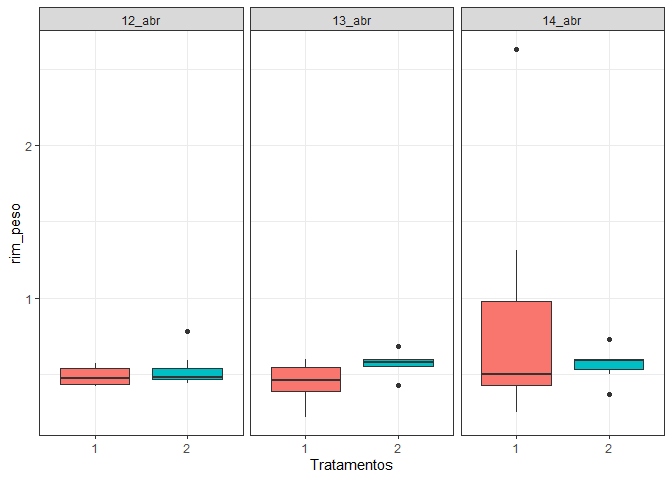<!-- -->

    #> ------------------------------------------------------------------------
    #> Legenda:
    #> FATOR 1:  Dia 
    #> FATOR 2:  Trat 
    #> ------------------------------------------------------------------------
    #> 
    #> 
    #> Quadro da analise de variancia
    #> ------------------------------------------------------------------------
    #>          GL     SQ QM      Fc   Pr>Fc
    #> Dia       2 0.4357  5 1.71256 0.19477
    #> Trat      1 0.0288  2 0.22645 0.63704
    #> Dia*Trat  2 0.3820  4 1.50145 0.23643
    #> Residuo  36 4.5800  3                
    #> Total    41 5.4266  1                
    #> ------------------------------------------------------------------------
    #> CV = 61.4 %
    #> 
    #> ------------------------------------------------------------------------
    #> Teste de normalidade dos residuos (Shapiro-Wilk)
    #> valor-p:  1.010816e-08 
    #> ATENCAO: a 5% de significancia, os residuos nao podem ser considerados normais!
    #> ------------------------------------------------------------------------
    #> 
    #> Interacao nao significativa: analisando os efeitos simples
    #> ------------------------------------------------------------------------
    #> Dia
    #> De acordo com o teste F, as medias desse fator sao estatisticamente iguais.
    #> ------------------------------------------------------------------------
    #>   Niveis    Medias
    #> 1 12_abr 0.5085714
    #> 2 13_abr 0.5092857
    #> 3 14_abr 0.7250000
    #> ------------------------------------------------------------------------
    #> Trat
    #> De acordo com o teste F, as medias desse fator sao estatisticamente iguais.
    #> ------------------------------------------------------------------------
    #>   Niveis    Medias
    #> 1      1 0.6071429
    #> 2      2 0.5547619
    #> ------------------------------------------------------------------------

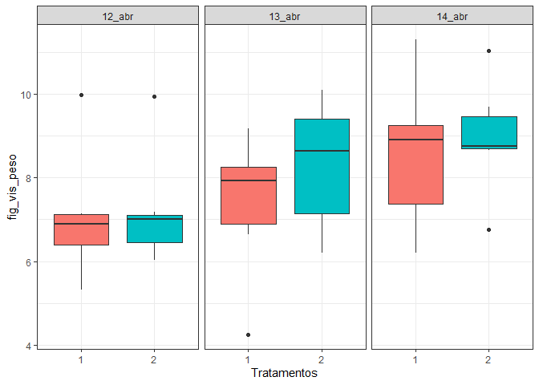<!-- -->

    #> ------------------------------------------------------------------------
    #> Legenda:
    #> FATOR 1:  Dia 
    #> FATOR 2:  Trat 
    #> ------------------------------------------------------------------------
    #> 
    #> 
    #> Quadro da analise de variancia
    #> ------------------------------------------------------------------------
    #>          GL      SQ QM     Fc   Pr>Fc
    #> Dia       2  19.296  5 4.3467 0.02037
    #> Trat      1   2.585  4 1.1647 0.28767
    #> Dia*Trat  2   1.120  2 0.2523 0.77837
    #> Residuo  36  79.906  3               
    #> Total    41 102.907  1               
    #> ------------------------------------------------------------------------
    #> CV = 18.87 %
    #> 
    #> ------------------------------------------------------------------------
    #> Teste de normalidade dos residuos (Shapiro-Wilk)
    #> valor-p:  0.5293369 
    #> De acordo com o teste de Shapiro-Wilk a 5% de significancia, os residuos podem ser considerados normais.
    #> ------------------------------------------------------------------------
    #> 
    #> Interacao nao significativa: analisando os efeitos simples
    #> ------------------------------------------------------------------------
    #> Dia
    #> Teste de Tukey
    #> ------------------------------------------------------------------------
    #> Grupos Tratamentos Medias
    #> a     14_abr      8.751429 
    #> ab    13_abr      7.834286 
    #>  b    12_abr      7.094286 
    #> ------------------------------------------------------------------------
    #> 
    #> Trat
    #> De acordo com o teste F, as medias desse fator sao estatisticamente iguais.
    #> ------------------------------------------------------------------------
    #>   Niveis   Medias
    #> 1      1 7.645238
    #> 2      2 8.141429
    #> ------------------------------------------------------------------------

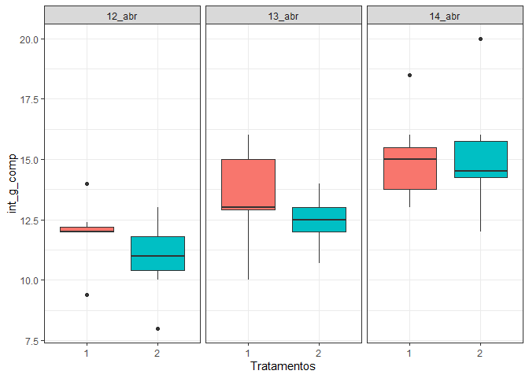<!-- -->

    #> ------------------------------------------------------------------------
    #> Legenda:
    #> FATOR 1:  Dia 
    #> FATOR 2:  Trat 
    #> ------------------------------------------------------------------------
    #> 
    #> 
    #> Quadro da analise de variancia
    #> ------------------------------------------------------------------------
    #>          GL      SQ QM     Fc   Pr>Fc
    #> Dia       2  94.695  5 14.676 0.00002
    #> Trat      1   4.339  4  1.345 0.25379
    #> Dia*Trat  2   3.859  2  0.598 0.55528
    #> Residuo  36 116.146  3               
    #> Total    41 219.038  1               
    #> ------------------------------------------------------------------------
    #> CV = 13.62 %
    #> 
    #> ------------------------------------------------------------------------
    #> Teste de normalidade dos residuos (Shapiro-Wilk)
    #> valor-p:  0.2625671 
    #> De acordo com o teste de Shapiro-Wilk a 5% de significancia, os residuos podem ser considerados normais.
    #> ------------------------------------------------------------------------
    #> 
    #> Interacao nao significativa: analisando os efeitos simples
    #> ------------------------------------------------------------------------
    #> Dia
    #> Teste de Tukey
    #> ------------------------------------------------------------------------
    #> Grupos Tratamentos Medias
    #> a     14_abr      15.10714 
    #>  b    13_abr      13 
    #>  b    12_abr      11.44286 
    #> ------------------------------------------------------------------------
    #> 
    #> Trat
    #> De acordo com o teste F, as medias desse fator sao estatisticamente iguais.
    #> ------------------------------------------------------------------------
    #>   Niveis   Medias
    #> 1      1 13.50476
    #> 2      2 12.86190
    #> ------------------------------------------------------------------------

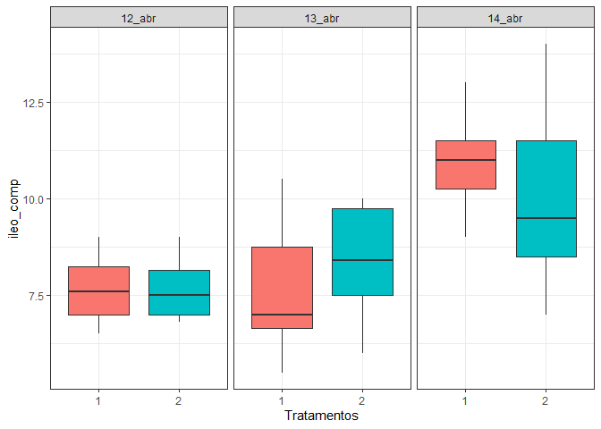<!-- -->

    #> ------------------------------------------------------------------------
    #> Legenda:
    #> FATOR 1:  Dia 
    #> FATOR 2:  Trat 
    #> ------------------------------------------------------------------------
    #> 
    #> 
    #> Quadro da analise de variancia
    #> ------------------------------------------------------------------------
    #>          GL      SQ QM      Fc   Pr>Fc
    #> Dia       2  66.447  5 13.2336 0.00005
    #> Trat      1   0.019  2  0.0077 0.93064
    #> Dia*Trat  2   4.410  3  0.8783 0.42421
    #> Residuo  36  90.380  4                
    #> Total    41 161.256  1                
    #> ------------------------------------------------------------------------
    #> CV = 18.14 %
    #> 
    #> ------------------------------------------------------------------------
    #> Teste de normalidade dos residuos (Shapiro-Wilk)
    #> valor-p:  0.7864416 
    #> De acordo com o teste de Shapiro-Wilk a 5% de significancia, os residuos podem ser considerados normais.
    #> ------------------------------------------------------------------------
    #> 
    #> Interacao nao significativa: analisando os efeitos simples
    #> ------------------------------------------------------------------------
    #> Dia
    #> Teste de Tukey
    #> ------------------------------------------------------------------------
    #> Grupos Tratamentos Medias
    #> a     14_abr      10.5 
    #>  b    13_abr      8.05 
    #>  b    12_abr      7.657143 
    #> ------------------------------------------------------------------------
    #> 
    #> Trat
    #> De acordo com o teste F, as medias desse fator sao estatisticamente iguais.
    #> ------------------------------------------------------------------------
    #>   Niveis   Medias
    #> 1      1 8.757143
    #> 2      2 8.714286
    #> ------------------------------------------------------------------------

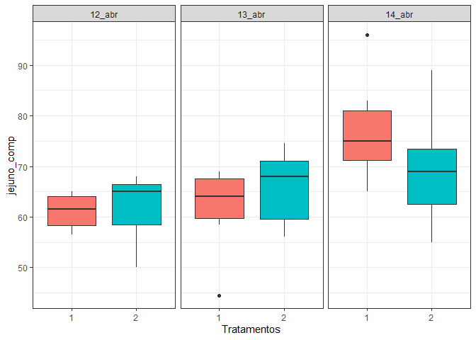<!-- -->

    #> ------------------------------------------------------------------------
    #> Legenda:
    #> FATOR 1:  Dia 
    #> FATOR 2:  Trat 
    #> ------------------------------------------------------------------------
    #> 
    #> 
    #> Quadro da analise de variancia
    #> ------------------------------------------------------------------------
    #>          GL     SQ QM     Fc   Pr>Fc
    #> Dia       2 1098.6  4 7.8280 0.00150
    #> Trat      1   12.1  2 0.1718 0.68100
    #> Dia*Trat  2  264.1  3 1.8821 0.16695
    #> Residuo  36 2526.2  5               
    #> Total    41 3901.0  1               
    #> ------------------------------------------------------------------------
    #> CV = 12.67 %
    #> 
    #> ------------------------------------------------------------------------
    #> Teste de normalidade dos residuos (Shapiro-Wilk)
    #> valor-p:  0.1858685 
    #> De acordo com o teste de Shapiro-Wilk a 5% de significancia, os residuos podem ser considerados normais.
    #> ------------------------------------------------------------------------
    #> 
    #> Interacao nao significativa: analisando os efeitos simples
    #> ------------------------------------------------------------------------
    #> Dia
    #> Teste de Tukey
    #> ------------------------------------------------------------------------
    #> Grupos Tratamentos Medias
    #> a     14_abr      73.25 
    #>  b    13_abr      63.67857 
    #>  b    12_abr      61.46429 
    #> ------------------------------------------------------------------------
    #> 
    #> Trat
    #> De acordo com o teste F, as medias desse fator sao estatisticamente iguais.
    #> ------------------------------------------------------------------------
    #>   Niveis   Medias
    #> 1      1 66.66667
    #> 2      2 65.59524
    #> ------------------------------------------------------------------------

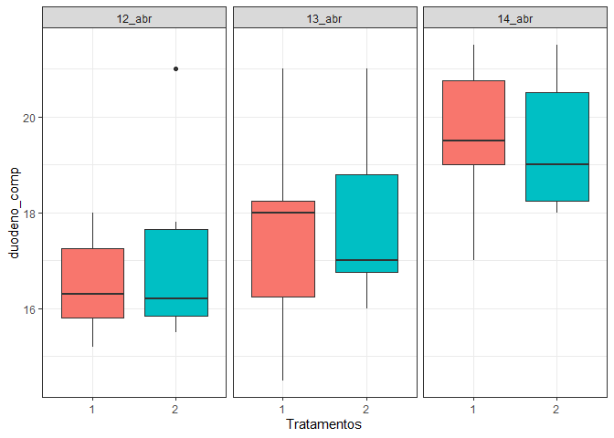<!-- -->

    #> ------------------------------------------------------------------------
    #> Legenda:
    #> FATOR 1:  Dia 
    #> FATOR 2:  Trat 
    #> ------------------------------------------------------------------------
    #> 
    #> 
    #> Quadro da analise de variancia
    #> ------------------------------------------------------------------------
    #>          GL      SQ QM     Fc   Pr>Fc
    #> Dia       2  54.318  5 9.5691 0.00046
    #> Trat      1   0.644  3 0.2268 0.63676
    #> Dia*Trat  2   1.200  2 0.2115 0.81038
    #> Residuo  36 102.174  4               
    #> Total    41 158.336  1               
    #> ------------------------------------------------------------------------
    #> CV = 9.35 %
    #> 
    #> ------------------------------------------------------------------------
    #> Teste de normalidade dos residuos (Shapiro-Wilk)
    #> valor-p:  0.1717189 
    #> De acordo com o teste de Shapiro-Wilk a 5% de significancia, os residuos podem ser considerados normais.
    #> ------------------------------------------------------------------------
    #> 
    #> Interacao nao significativa: analisando os efeitos simples
    #> ------------------------------------------------------------------------
    #> Dia
    #> Teste de Tukey
    #> ------------------------------------------------------------------------
    #> Grupos Tratamentos Medias
    #> a     14_abr      19.53571 
    #>  b    13_abr      17.68571 
    #>  b    12_abr      16.80714 
    #> ------------------------------------------------------------------------
    #> 
    #> Trat
    #> De acordo com o teste F, as medias desse fator sao estatisticamente iguais.
    #> ------------------------------------------------------------------------
    #>   Niveis   Medias
    #> 1      1 17.88571
    #> 2      2 18.13333
    #> ------------------------------------------------------------------------

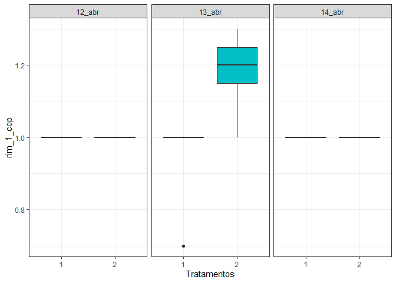<!-- -->

    #> ------------------------------------------------------------------------
    #> Legenda:
    #> FATOR 1:  Dia 
    #> FATOR 2:  Trat 
    #> ------------------------------------------------------------------------
    #> 
    #> 
    #> Quadro da analise de variancia
    #> ------------------------------------------------------------------------
    #>          GL      SQ QM      Fc     Pr>Fc
    #> Dia       2 0.04762  3  5.8824 0.0061591
    #> Trat      1 0.06095  5 15.0588 0.0004266
    #> Dia*Trat  2 0.12190  4 15.0588 0.0000177
    #> Residuo  36 0.14571  2                  
    #> Total    41 0.37619  1                  
    #> ------------------------------------------------------------------------
    #> CV = 6.21 %
    #> 
    #> ------------------------------------------------------------------------
    #> Teste de normalidade dos residuos (Shapiro-Wilk)
    #> valor-p:  1.582903e-09 
    #> ATENCAO: a 5% de significancia, os residuos nao podem ser considerados normais!
    #> ------------------------------------------------------------------------
    #> 
    #> 
    #> 
    #> Interacao significativa: desdobrando a interacao
    #> ------------------------------------------------------------------------
    #> 
    #> Desdobrando  Dia  dentro de cada nivel de  Trat 
    #> ------------------------------------------------------------------------
    #> ------------------------------------------------------------------------
    #> Quadro da analise de variancia
    #> ------------------------------------------------------------------------
    #>            GL      SQ      QM      Fc  Pr.Fc
    #> Trat        1 0.06095 0.06095 15.0588  4e-04
    #> Dia:Trat 1  2 0.00857 0.00429  1.0588 0.3574
    #> Dia:Trat 2  2 0.16095 0.08048 19.8824      0
    #> Residuo    36 0.14571 0.00405               
    #> Total      41 0.37619 0.00918               
    #> ------------------------------------------------------------------------
    #> 
    #> 
    #> 
    #>  Dia  dentro do nivel  1  de  Trat 
    #> 
    #> De acordo com o teste F, as medias desse fator sao estatisticamente iguais.
    #> ------------------------------------------------------------------------
    #>   Niveis    Medias
    #> 1 12_abr 1.0000000
    #> 2 13_abr 0.9571429
    #> 3 14_abr 1.0000000
    #> ------------------------------------------------------------------------
    #> 
    #> 
    #>  Dia  dentro do nivel  2  de  Trat 
    #> ------------------------------------------------------------------------
    #> Teste de Tukey
    #> ------------------------------------------------------------------------
    #> Grupos Tratamentos Medias
    #> a     13_abr      1.185714 
    #>  b    12_abr      1 
    #>  b    14_abr      1 
    #> ------------------------------------------------------------------------
    #> 
    #> 
    #> 
    #> Desdobrando  Trat  dentro de cada nivel de  Dia 
    #> ------------------------------------------------------------------------
    #> ------------------------------------------------------------------------
    #> Quadro da analise de variancia
    #> ------------------------------------------------------------------------
    #>                 GL      SQ      QM      Fc  Pr.Fc
    #> Dia              2 0.04762 0.02381  5.8824 0.0062
    #> Trat:Dia 12_abr  1 0.00000 0.00000       0      1
    #> Trat:Dia 13_abr  1 0.18286 0.18286 45.1765      0
    #> Trat:Dia 14_abr  1 0.00000 0.00000       0      1
    #> Residuo         36 0.14571 0.00405               
    #> Total           41 0.37619 0.00918               
    #> ------------------------------------------------------------------------
    #> 
    #> 
    #> 
    #>  Trat  dentro do nivel  12_abr  de  Dia 
    #> 
    #> De acordo com o teste F, as medias desse fator sao estatisticamente iguais.
    #> ------------------------------------------------------------------------
    #>   Niveis Medias
    #> 1      1      1
    #> 2      2      1
    #> ------------------------------------------------------------------------
    #> 
    #> 
    #>  Trat  dentro do nivel  13_abr  de  Dia 
    #> ------------------------------------------------------------------------
    #> Teste de Tukey
    #> ------------------------------------------------------------------------
    #> Grupos Tratamentos Medias
    #> a     2   1.185714 
    #>  b    1   0.9571429 
    #> ------------------------------------------------------------------------
    #> 
    #> 
    #>  Trat  dentro do nivel  14_abr  de  Dia 
    #> 
    #> De acordo com o teste F, as medias desse fator sao estatisticamente iguais.
    #> ------------------------------------------------------------------------
    #>   Niveis Medias
    #> 1      1      1
    #> 2      2      1
    #> ------------------------------------------------------------------------

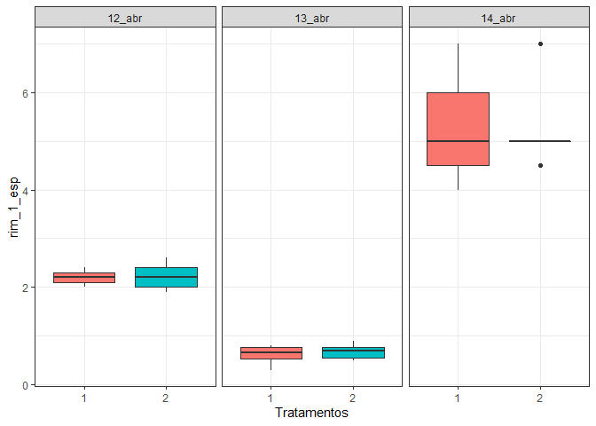<!-- -->

    #> ------------------------------------------------------------------------
    #> Legenda:
    #> FATOR 1:  Dia 
    #> FATOR 2:  Trat 
    #> ------------------------------------------------------------------------
    #> 
    #> 
    #> Quadro da analise de variancia
    #> ------------------------------------------------------------------------
    #>          GL      SQ QM      Fc   Pr>Fc
    #> Dia       2 144.425  5 201.208 0.00000
    #> Trat      1   0.000  4   0.000 1.00000
    #> Dia*Trat  2   0.032  2   0.044 0.95658
    #> Residuo  34  12.202  3                
    #> Total    39 156.659  1                
    #> ------------------------------------------------------------------------
    #> CV = NA %
    #> 
    #> ------------------------------------------------------------------------
    #> Teste de normalidade dos residuos (Shapiro-Wilk)
    #> valor-p:  2.123524e-05 
    #> ATENCAO: a 5% de significancia, os residuos nao podem ser considerados normais!
    #> ------------------------------------------------------------------------
    #> 
    #> Interacao nao significativa: analisando os efeitos simples
    #> ------------------------------------------------------------------------
    #> Dia
    #> Teste de Tukey
    #> ------------------------------------------------------------------------
    #> Grupos Tratamentos Medias
    #> a     14_abr      5.25 
    #>  b    12_abr      2.207143 
    #>   c   13_abr      0.65 
    #> ------------------------------------------------------------------------
    #> 
    #> Trat
    #> De acordo com o teste F, as medias desse fator sao estatisticamente iguais.
    #> ------------------------------------------------------------------------
    #>   Niveis Medias
    #> 1      1     NA
    #> 2      2     NA
    #> ------------------------------------------------------------------------

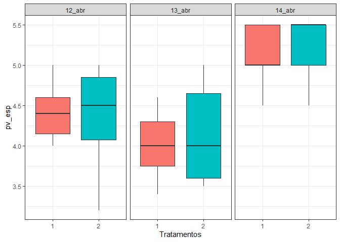<!-- -->

    #> ------------------------------------------------------------------------
    #> Legenda:
    #> FATOR 1:  Dia 
    #> FATOR 2:  Trat 
    #> ------------------------------------------------------------------------
    #> 
    #> 
    #> Quadro da analise de variancia
    #> ------------------------------------------------------------------------
    #>          GL      SQ QM      Fc   Pr>Fc
    #> Dia       2  8.9984  5 18.8928 0.00000
    #> Trat      1  0.0237  2  0.0995 0.75433
    #> Dia*Trat  2  0.0654  3  0.1373 0.87221
    #> Residuo  35  8.3350  4                
    #> Total    40 17.4224  1                
    #> ------------------------------------------------------------------------
    #> CV = NA %
    #> 
    #> ------------------------------------------------------------------------
    #> Teste de normalidade dos residuos (Shapiro-Wilk)
    #> valor-p:  0.3265092 
    #> De acordo com o teste de Shapiro-Wilk a 5% de significancia, os residuos podem ser considerados normais.
    #> ------------------------------------------------------------------------
    #> 
    #> Interacao nao significativa: analisando os efeitos simples
    #> ------------------------------------------------------------------------
    #> Dia
    #> Teste de Tukey
    #> ------------------------------------------------------------------------
    #> Grupos Tratamentos Medias
    #> a     14_abr      5.178571 
    #>  b    12_abr      4.384615 
    #>  b    13_abr      4.078571 
    #> ------------------------------------------------------------------------
    #> 
    #> Trat
    #> De acordo com o teste F, as medias desse fator sao estatisticamente iguais.
    #> ------------------------------------------------------------------------
    #>   Niveis  Medias
    #> 1      1 4.52381
    #> 2      2      NA
    #> ------------------------------------------------------------------------

### Coleta 02

### Coleta 03
