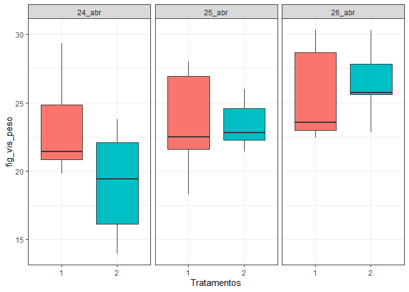
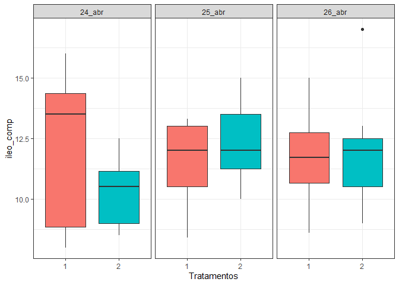
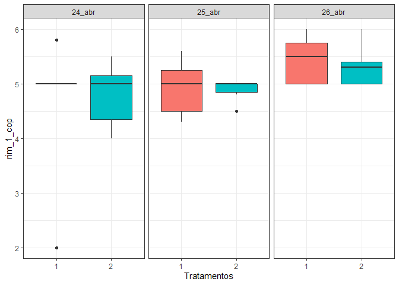
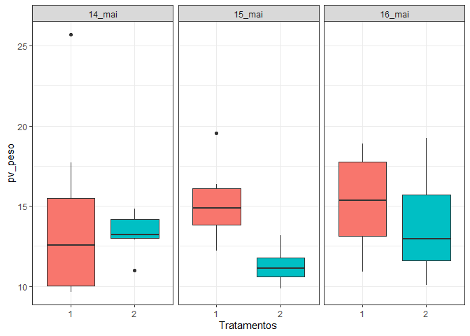

<!-- README.md is generated from README.Rmd. Please edit that file -->

# Análise Adriano - Lizandra

## Análise para Macroscópica

``` r
library(tidyverse)
library(readxl)
library(ExpDes.pt)
library(emmeans)
library(lmerTest)
library(ggpubr)
library(rstatix)
macroscopia <- read_excel("data/macroscopia.xlsx",na = "NA")
head(macroscopia)
#> # A tibble: 6 x 23
#>   coleta data    trat   rep  peso int_g_peso ileo_peso jejuno_peso duodeno_peso
#>    <dbl> <chr>  <dbl> <dbl> <dbl>      <dbl>     <dbl>       <dbl>        <dbl>
#> 1      1 12_abr     1     1  165.       2.75      0.71        6.99         3.38
#> 2      1 12_abr     1     2  180.       2.6       0.77        7.19         2.39
#> 3      1 12_abr     1     3  179.       2.95      0.84        7.09         2.44
#> 4      1 12_abr     1     4  191.       3.02      0.84        8.79         3.49
#> 5      1 12_abr     1     5  210.       2.55      0.71        7.1          2.88
#> 6      1 12_abr     1     6  144.       2.29      0.77        5.42         1.97
#> # ... with 14 more variables: pancreas_peso <dbl>, mc_peso <dbl>,
#> #   msc_peso <dbl>, pv_peso <dbl>, baco_peso <dbl>, rim_peso <dbl>,
#> #   fig_vis_peso <dbl>, int_g_comp <dbl>, ileo_comp <dbl>, jejuno_comp <dbl>,
#> #   duodeno_comp <dbl>, rim_1_cop <dbl>, rim_1_esp <dbl>, pv_esp <dbl>
```

### Coleta 01

``` r
dados <- macroscopia %>% 
  filter(coleta==1)

for( i in 5:length(macroscopia)){
  variavel <- names(macroscopia[i])
  df <- dados %>% 
    select(data,trat,variavel)
  names(df) <- c("data","trat","y")
  plot_1 <- df %>% 
  group_by(data, trat) %>% 
  ggplot(aes(y=y, x= as.factor(trat), fill=as.factor(trat))) +
  geom_boxplot() +
  facet_wrap(~data)+
  theme_bw() +
  labs(x="Tratamentos", y=variavel)+
  theme(legend.position="none")
  print(plot_1)
  dia <- df %>% pull(data)
  trat <- df %>% pull(trat)
  y <- df %>%  pull(y)
  fat2.dic(dia, trat, y, fac.names = c("Dia","Trat"))
}
```

<!-- -->

    #> ------------------------------------------------------------------------
    #> Legenda:
    #> FATOR 1:  Dia 
    #> FATOR 2:  Trat 
    #> ------------------------------------------------------------------------
    #> 
    #> 
    #> Quadro da analise de variancia
    #> ------------------------------------------------------------------------
    #>          GL    SQ QM      Fc   Pr>Fc
    #> Dia       2 39748  3 14.1333 0.00003
    #> Trat      1  4144  4  2.9473 0.09462
    #> Dia*Trat  2   922  5  0.3278 0.72262
    #> Residuo  36 50622  2                
    #> Total    41 95436  1                
    #> ------------------------------------------------------------------------
    #> CV = 16.97 %
    #> 
    #> ------------------------------------------------------------------------
    #> Teste de normalidade dos residuos (Shapiro-Wilk)
    #> valor-p:  6.976853e-05 
    #> ATENCAO: a 5% de significancia, os residuos nao podem ser considerados normais!
    #> ------------------------------------------------------------------------
    #> 
    #> Interacao nao significativa: analisando os efeitos simples
    #> ------------------------------------------------------------------------
    #> Dia
    #> Teste de Tukey
    #> ------------------------------------------------------------------------
    #> Grupos Tratamentos Medias
    #> a     14_abr      260.0129 
    #>  b    13_abr      218.2421 
    #>  b    12_abr      184.8129 
    #> ------------------------------------------------------------------------
    #> 
    #> Trat
    #> De acordo com o teste F, as medias desse fator sao estatisticamente iguais.
    #> ------------------------------------------------------------------------
    #>   Niveis   Medias
    #> 1      1 211.0890
    #> 2      2 230.9562
    #> ------------------------------------------------------------------------

<!-- -->

    #> ------------------------------------------------------------------------
    #> Legenda:
    #> FATOR 1:  Dia 
    #> FATOR 2:  Trat 
    #> ------------------------------------------------------------------------
    #> 
    #> 
    #> Quadro da analise de variancia
    #> ------------------------------------------------------------------------
    #>          GL      SQ QM     Fc   Pr>Fc
    #> Dia       2  8.2656  5 8.5358 0.00092
    #> Trat      1  0.1840  2 0.3800 0.54146
    #> Dia*Trat  2  0.5156  3 0.5325 0.59171
    #> Residuo  36 17.4303  4               
    #> Total    41 26.3956  1               
    #> ------------------------------------------------------------------------
    #> CV = 21.04 %
    #> 
    #> ------------------------------------------------------------------------
    #> Teste de normalidade dos residuos (Shapiro-Wilk)
    #> valor-p:  0.62849 
    #> De acordo com o teste de Shapiro-Wilk a 5% de significancia, os residuos podem ser considerados normais.
    #> ------------------------------------------------------------------------
    #> 
    #> Interacao nao significativa: analisando os efeitos simples
    #> ------------------------------------------------------------------------
    #> Dia
    #> Teste de Tukey
    #> ------------------------------------------------------------------------
    #> Grupos Tratamentos Medias
    #> a     14_abr      3.717857 
    #> a     13_abr      3.513571 
    #>  b    12_abr      2.691429 
    #> ------------------------------------------------------------------------
    #> 
    #> Trat
    #> De acordo com o teste F, as medias desse fator sao estatisticamente iguais.
    #> ------------------------------------------------------------------------
    #>   Niveis   Medias
    #> 1      1 3.241429
    #> 2      2 3.373810
    #> ------------------------------------------------------------------------

<!-- -->

    #> ------------------------------------------------------------------------
    #> Legenda:
    #> FATOR 1:  Dia 
    #> FATOR 2:  Trat 
    #> ------------------------------------------------------------------------
    #> 
    #> 
    #> Quadro da analise de variancia
    #> ------------------------------------------------------------------------
    #>          GL     SQ QM     Fc   Pr>Fc
    #> Dia       2 1.4057  5 8.0260 0.00131
    #> Trat      1 0.0038  2 0.0435 0.83596
    #> Dia*Trat  2 0.0310  3 0.1769 0.83855
    #> Residuo  36 3.1527  4               
    #> Total    41 4.5932  1               
    #> ------------------------------------------------------------------------
    #> CV = 29.31 %
    #> 
    #> ------------------------------------------------------------------------
    #> Teste de normalidade dos residuos (Shapiro-Wilk)
    #> valor-p:  0.003158621 
    #> ATENCAO: a 5% de significancia, os residuos nao podem ser considerados normais!
    #> ------------------------------------------------------------------------
    #> 
    #> Interacao nao significativa: analisando os efeitos simples
    #> ------------------------------------------------------------------------
    #> Dia
    #> Teste de Tukey
    #> ------------------------------------------------------------------------
    #> Grupos Tratamentos Medias
    #> a     14_abr      1.248571 
    #> ab    13_abr      0.9757143 
    #>  b    12_abr      0.8042857 
    #> ------------------------------------------------------------------------
    #> 
    #> Trat
    #> De acordo com o teste F, as medias desse fator sao estatisticamente iguais.
    #> ------------------------------------------------------------------------
    #>   Niveis   Medias
    #> 1      1 1.019048
    #> 2      2 1.000000
    #> ------------------------------------------------------------------------

<!-- -->

    #> ------------------------------------------------------------------------
    #> Legenda:
    #> FATOR 1:  Dia 
    #> FATOR 2:  Trat 
    #> ------------------------------------------------------------------------
    #> 
    #> 
    #> Quadro da analise de variancia
    #> ------------------------------------------------------------------------
    #>          GL      SQ QM     Fc   Pr>Fc
    #> Dia       2  47.077  4 9.0418 0.00066
    #> Trat      1   4.352  5 1.6718 0.20426
    #> Dia*Trat  2   0.663  2 0.1272 0.88091
    #> Residuo  36  93.718  3               
    #> Total    41 145.810  1               
    #> ------------------------------------------------------------------------
    #> CV = 19.04 %
    #> 
    #> ------------------------------------------------------------------------
    #> Teste de normalidade dos residuos (Shapiro-Wilk)
    #> valor-p:  0.0007324651 
    #> ATENCAO: a 5% de significancia, os residuos nao podem ser considerados normais!
    #> ------------------------------------------------------------------------
    #> 
    #> Interacao nao significativa: analisando os efeitos simples
    #> ------------------------------------------------------------------------
    #> Dia
    #> Teste de Tukey
    #> ------------------------------------------------------------------------
    #> Grupos Tratamentos Medias
    #> a     14_abr      9.812857 
    #> ab    13_abr      8.382857 
    #>  b    12_abr      7.224286 
    #> ------------------------------------------------------------------------
    #> 
    #> Trat
    #> De acordo com o teste F, as medias desse fator sao estatisticamente iguais.
    #> ------------------------------------------------------------------------
    #>   Niveis   Medias
    #> 1      1 8.151429
    #> 2      2 8.795238
    #> ------------------------------------------------------------------------

<!-- -->

    #> ------------------------------------------------------------------------
    #> Legenda:
    #> FATOR 1:  Dia 
    #> FATOR 2:  Trat 
    #> ------------------------------------------------------------------------
    #> 
    #> 
    #> Quadro da analise de variancia
    #> ------------------------------------------------------------------------
    #>          GL      SQ QM      Fc   Pr>Fc
    #> Dia       2 10.8316  5 21.7213 0.00000
    #> Trat      1  0.2736  4  1.0974 0.30182
    #> Dia*Trat  2  0.1399  2  0.2806 0.75694
    #> Residuo  36  8.9759  3                
    #> Total    41 20.2211  1                
    #> ------------------------------------------------------------------------
    #> CV = 14.19 %
    #> 
    #> ------------------------------------------------------------------------
    #> Teste de normalidade dos residuos (Shapiro-Wilk)
    #> valor-p:  0.4687477 
    #> De acordo com o teste de Shapiro-Wilk a 5% de significancia, os residuos podem ser considerados normais.
    #> ------------------------------------------------------------------------
    #> 
    #> Interacao nao significativa: analisando os efeitos simples
    #> ------------------------------------------------------------------------
    #> Dia
    #> Teste de Tukey
    #> ------------------------------------------------------------------------
    #> Grupos Tratamentos Medias
    #> a     14_abr      4.066429 
    #> a     13_abr      3.645 
    #>  b    12_abr      2.842143 
    #> ------------------------------------------------------------------------
    #> 
    #> Trat
    #> De acordo com o teste F, as medias desse fator sao estatisticamente iguais.
    #> ------------------------------------------------------------------------
    #>   Niveis   Medias
    #> 1      1 3.437143
    #> 2      2 3.598571
    #> ------------------------------------------------------------------------

<!-- -->

    #> ------------------------------------------------------------------------
    #> Legenda:
    #> FATOR 1:  Dia 
    #> FATOR 2:  Trat 
    #> ------------------------------------------------------------------------
    #> 
    #> 
    #> Quadro da analise de variancia
    #> ------------------------------------------------------------------------
    #>          GL      SQ QM      Fc   Pr>Fc
    #> Dia       2 1.41773  5 15.5469 0.00001
    #> Trat      1 0.01486  2  0.3259 0.57163
    #> Dia*Trat  2 0.05768  3  0.6325 0.53707
    #> Residuo  36 1.64143  4                
    #> Total    41 3.13170  1                
    #> ------------------------------------------------------------------------
    #> CV = 21.64 %
    #> 
    #> ------------------------------------------------------------------------
    #> Teste de normalidade dos residuos (Shapiro-Wilk)
    #> valor-p:  0.5814811 
    #> De acordo com o teste de Shapiro-Wilk a 5% de significancia, os residuos podem ser considerados normais.
    #> ------------------------------------------------------------------------
    #> 
    #> Interacao nao significativa: analisando os efeitos simples
    #> ------------------------------------------------------------------------
    #> Dia
    #> Teste de Tukey
    #> ------------------------------------------------------------------------
    #> Grupos Tratamentos Medias
    #> a     14_abr      1.200714 
    #> a     13_abr      1.007857 
    #>  b    12_abr      0.7521429 
    #> ------------------------------------------------------------------------
    #> 
    #> Trat
    #> De acordo com o teste F, as medias desse fator sao estatisticamente iguais.
    #> ------------------------------------------------------------------------
    #>   Niveis    Medias
    #> 1      1 0.9680952
    #> 2      2 1.0057143
    #> ------------------------------------------------------------------------

<!-- -->

    #> ------------------------------------------------------------------------
    #> Legenda:
    #> FATOR 1:  Dia 
    #> FATOR 2:  Trat 
    #> ------------------------------------------------------------------------
    #> 
    #> 
    #> Quadro da analise de variancia
    #> ------------------------------------------------------------------------
    #>          GL      SQ QM     Fc   Pr>Fc
    #> Dia       2  83.049  5 9.7781 0.00041
    #> Trat      1  10.741  3 2.5294 0.12049
    #> Dia*Trat  2   0.255  2 0.0300 0.97047
    #> Residuo  36 152.880  4               
    #> Total    41 246.925  1               
    #> ------------------------------------------------------------------------
    #> CV = 15.96 %
    #> 
    #> ------------------------------------------------------------------------
    #> Teste de normalidade dos residuos (Shapiro-Wilk)
    #> valor-p:  0.9807559 
    #> De acordo com o teste de Shapiro-Wilk a 5% de significancia, os residuos podem ser considerados normais.
    #> ------------------------------------------------------------------------
    #> 
    #> Interacao nao significativa: analisando os efeitos simples
    #> ------------------------------------------------------------------------
    #> Dia
    #> Teste de Tukey
    #> ------------------------------------------------------------------------
    #> Grupos Tratamentos Medias
    #> a     14_abr      14.84286 
    #>  b    13_abr      12.37714 
    #>  b    12_abr      11.52714 
    #> ------------------------------------------------------------------------
    #> 
    #> Trat
    #> De acordo com o teste F, as medias desse fator sao estatisticamente iguais.
    #> ------------------------------------------------------------------------
    #>   Niveis   Medias
    #> 1      1 12.41000
    #> 2      2 13.42143
    #> ------------------------------------------------------------------------

<!-- -->

    #> ------------------------------------------------------------------------
    #> Legenda:
    #> FATOR 1:  Dia 
    #> FATOR 2:  Trat 
    #> ------------------------------------------------------------------------
    #> 
    #> 
    #> Quadro da analise de variancia
    #> ------------------------------------------------------------------------
    #>          GL     SQ QM     Fc   Pr>Fc
    #> Dia       2 15.369  5 5.5845 0.00772
    #> Trat      1  1.382  4 1.0047 0.32287
    #> Dia*Trat  2  1.597  2 0.5803 0.56487
    #> Residuo  36 49.538  3               
    #> Total    41 67.886  1               
    #> ------------------------------------------------------------------------
    #> CV = 15.34 %
    #> 
    #> ------------------------------------------------------------------------
    #> Teste de normalidade dos residuos (Shapiro-Wilk)
    #> valor-p:  0.166831 
    #> De acordo com o teste de Shapiro-Wilk a 5% de significancia, os residuos podem ser considerados normais.
    #> ------------------------------------------------------------------------
    #> 
    #> Interacao nao significativa: analisando os efeitos simples
    #> ------------------------------------------------------------------------
    #> Dia
    #> Teste de Tukey
    #> ------------------------------------------------------------------------
    #> Grupos Tratamentos Medias
    #> a     14_abr      8.454286 
    #> ab    13_abr      7.492857 
    #>  b    12_abr      6.997143 
    #> ------------------------------------------------------------------------
    #> 
    #> Trat
    #> De acordo com o teste F, as medias desse fator sao estatisticamente iguais.
    #> ------------------------------------------------------------------------
    #>   Niveis   Medias
    #> 1      1 7.466667
    #> 2      2 7.829524
    #> ------------------------------------------------------------------------

<!-- -->

    #> ------------------------------------------------------------------------
    #> Legenda:
    #> FATOR 1:  Dia 
    #> FATOR 2:  Trat 
    #> ------------------------------------------------------------------------
    #> 
    #> 
    #> Quadro da analise de variancia
    #> ------------------------------------------------------------------------
    #>          GL     SQ QM     Fc   Pr>Fc
    #> Dia       2 1.3758  5 6.0657 0.00537
    #> Trat      1 0.0672  2 0.5926 0.44645
    #> Dia*Trat  2 0.1393  3 0.6140 0.54676
    #> Residuo  36 4.0826  4               
    #> Total    41 5.6648  1               
    #> ------------------------------------------------------------------------
    #> CV = 16.15 %
    #> 
    #> ------------------------------------------------------------------------
    #> Teste de normalidade dos residuos (Shapiro-Wilk)
    #> valor-p:  0.639612 
    #> De acordo com o teste de Shapiro-Wilk a 5% de significancia, os residuos podem ser considerados normais.
    #> ------------------------------------------------------------------------
    #> 
    #> Interacao nao significativa: analisando os efeitos simples
    #> ------------------------------------------------------------------------
    #> Dia
    #> Teste de Tukey
    #> ------------------------------------------------------------------------
    #> Grupos Tratamentos Medias
    #> a     14_abr      2.334286 
    #>  b    13_abr      2.014286 
    #>  b    12_abr      1.908571 
    #> ------------------------------------------------------------------------
    #> 
    #> Trat
    #> De acordo com o teste F, as medias desse fator sao estatisticamente iguais.
    #> ------------------------------------------------------------------------
    #>   Niveis   Medias
    #> 1      1 2.045714
    #> 2      2 2.125714
    #> ------------------------------------------------------------------------

<!-- -->

    #> ------------------------------------------------------------------------
    #> Legenda:
    #> FATOR 1:  Dia 
    #> FATOR 2:  Trat 
    #> ------------------------------------------------------------------------
    #> 
    #> 
    #> Quadro da analise de variancia
    #> ------------------------------------------------------------------------
    #>          GL      SQ QM      Fc   Pr>Fc
    #> Dia       2 0.02905  3 0.25617 0.77541
    #> Trat      1 0.05944  5 1.04838 0.31271
    #> Dia*Trat  2 0.02185  2 0.19268 0.82559
    #> Residuo  36 2.04103  4                
    #> Total    41 2.15136  1                
    #> ------------------------------------------------------------------------
    #> CV = 87.88 %
    #> 
    #> ------------------------------------------------------------------------
    #> Teste de normalidade dos residuos (Shapiro-Wilk)
    #> valor-p:  1.230677e-09 
    #> ATENCAO: a 5% de significancia, os residuos nao podem ser considerados normais!
    #> ------------------------------------------------------------------------
    #> 
    #> Interacao nao significativa: analisando os efeitos simples
    #> ------------------------------------------------------------------------
    #> Dia
    #> De acordo com o teste F, as medias desse fator sao estatisticamente iguais.
    #> ------------------------------------------------------------------------
    #>   Niveis    Medias
    #> 1 12_abr 0.3042857
    #> 2 13_abr 0.2400000
    #> 3 14_abr 0.2685714
    #> ------------------------------------------------------------------------
    #> Trat
    #> De acordo com o teste F, as medias desse fator sao estatisticamente iguais.
    #> ------------------------------------------------------------------------
    #>   Niveis    Medias
    #> 1      1 0.2333333
    #> 2      2 0.3085714
    #> ------------------------------------------------------------------------

<!-- -->

    #> ------------------------------------------------------------------------
    #> Legenda:
    #> FATOR 1:  Dia 
    #> FATOR 2:  Trat 
    #> ------------------------------------------------------------------------
    #> 
    #> 
    #> Quadro da analise de variancia
    #> ------------------------------------------------------------------------
    #>          GL     SQ QM      Fc   Pr>Fc
    #> Dia       2 0.4357  5 1.71256 0.19477
    #> Trat      1 0.0288  2 0.22645 0.63704
    #> Dia*Trat  2 0.3820  4 1.50145 0.23643
    #> Residuo  36 4.5800  3                
    #> Total    41 5.4266  1                
    #> ------------------------------------------------------------------------
    #> CV = 61.4 %
    #> 
    #> ------------------------------------------------------------------------
    #> Teste de normalidade dos residuos (Shapiro-Wilk)
    #> valor-p:  1.010816e-08 
    #> ATENCAO: a 5% de significancia, os residuos nao podem ser considerados normais!
    #> ------------------------------------------------------------------------
    #> 
    #> Interacao nao significativa: analisando os efeitos simples
    #> ------------------------------------------------------------------------
    #> Dia
    #> De acordo com o teste F, as medias desse fator sao estatisticamente iguais.
    #> ------------------------------------------------------------------------
    #>   Niveis    Medias
    #> 1 12_abr 0.5085714
    #> 2 13_abr 0.5092857
    #> 3 14_abr 0.7250000
    #> ------------------------------------------------------------------------
    #> Trat
    #> De acordo com o teste F, as medias desse fator sao estatisticamente iguais.
    #> ------------------------------------------------------------------------
    #>   Niveis    Medias
    #> 1      1 0.6071429
    #> 2      2 0.5547619
    #> ------------------------------------------------------------------------

<!-- -->

    #> ------------------------------------------------------------------------
    #> Legenda:
    #> FATOR 1:  Dia 
    #> FATOR 2:  Trat 
    #> ------------------------------------------------------------------------
    #> 
    #> 
    #> Quadro da analise de variancia
    #> ------------------------------------------------------------------------
    #>          GL      SQ QM     Fc   Pr>Fc
    #> Dia       2  19.296  5 4.3467 0.02037
    #> Trat      1   2.585  4 1.1647 0.28767
    #> Dia*Trat  2   1.120  2 0.2523 0.77837
    #> Residuo  36  79.906  3               
    #> Total    41 102.907  1               
    #> ------------------------------------------------------------------------
    #> CV = 18.87 %
    #> 
    #> ------------------------------------------------------------------------
    #> Teste de normalidade dos residuos (Shapiro-Wilk)
    #> valor-p:  0.5293369 
    #> De acordo com o teste de Shapiro-Wilk a 5% de significancia, os residuos podem ser considerados normais.
    #> ------------------------------------------------------------------------
    #> 
    #> Interacao nao significativa: analisando os efeitos simples
    #> ------------------------------------------------------------------------
    #> Dia
    #> Teste de Tukey
    #> ------------------------------------------------------------------------
    #> Grupos Tratamentos Medias
    #> a     14_abr      8.751429 
    #> ab    13_abr      7.834286 
    #>  b    12_abr      7.094286 
    #> ------------------------------------------------------------------------
    #> 
    #> Trat
    #> De acordo com o teste F, as medias desse fator sao estatisticamente iguais.
    #> ------------------------------------------------------------------------
    #>   Niveis   Medias
    #> 1      1 7.645238
    #> 2      2 8.141429
    #> ------------------------------------------------------------------------

<!-- -->

    #> ------------------------------------------------------------------------
    #> Legenda:
    #> FATOR 1:  Dia 
    #> FATOR 2:  Trat 
    #> ------------------------------------------------------------------------
    #> 
    #> 
    #> Quadro da analise de variancia
    #> ------------------------------------------------------------------------
    #>          GL      SQ QM     Fc   Pr>Fc
    #> Dia       2  94.695  5 14.676 0.00002
    #> Trat      1   4.339  4  1.345 0.25379
    #> Dia*Trat  2   3.859  2  0.598 0.55528
    #> Residuo  36 116.146  3               
    #> Total    41 219.038  1               
    #> ------------------------------------------------------------------------
    #> CV = 13.62 %
    #> 
    #> ------------------------------------------------------------------------
    #> Teste de normalidade dos residuos (Shapiro-Wilk)
    #> valor-p:  0.2625671 
    #> De acordo com o teste de Shapiro-Wilk a 5% de significancia, os residuos podem ser considerados normais.
    #> ------------------------------------------------------------------------
    #> 
    #> Interacao nao significativa: analisando os efeitos simples
    #> ------------------------------------------------------------------------
    #> Dia
    #> Teste de Tukey
    #> ------------------------------------------------------------------------
    #> Grupos Tratamentos Medias
    #> a     14_abr      15.10714 
    #>  b    13_abr      13 
    #>  b    12_abr      11.44286 
    #> ------------------------------------------------------------------------
    #> 
    #> Trat
    #> De acordo com o teste F, as medias desse fator sao estatisticamente iguais.
    #> ------------------------------------------------------------------------
    #>   Niveis   Medias
    #> 1      1 13.50476
    #> 2      2 12.86190
    #> ------------------------------------------------------------------------

<!-- -->

    #> ------------------------------------------------------------------------
    #> Legenda:
    #> FATOR 1:  Dia 
    #> FATOR 2:  Trat 
    #> ------------------------------------------------------------------------
    #> 
    #> 
    #> Quadro da analise de variancia
    #> ------------------------------------------------------------------------
    #>          GL      SQ QM      Fc   Pr>Fc
    #> Dia       2  66.447  5 13.2336 0.00005
    #> Trat      1   0.019  2  0.0077 0.93064
    #> Dia*Trat  2   4.410  3  0.8783 0.42421
    #> Residuo  36  90.380  4                
    #> Total    41 161.256  1                
    #> ------------------------------------------------------------------------
    #> CV = 18.14 %
    #> 
    #> ------------------------------------------------------------------------
    #> Teste de normalidade dos residuos (Shapiro-Wilk)
    #> valor-p:  0.7864416 
    #> De acordo com o teste de Shapiro-Wilk a 5% de significancia, os residuos podem ser considerados normais.
    #> ------------------------------------------------------------------------
    #> 
    #> Interacao nao significativa: analisando os efeitos simples
    #> ------------------------------------------------------------------------
    #> Dia
    #> Teste de Tukey
    #> ------------------------------------------------------------------------
    #> Grupos Tratamentos Medias
    #> a     14_abr      10.5 
    #>  b    13_abr      8.05 
    #>  b    12_abr      7.657143 
    #> ------------------------------------------------------------------------
    #> 
    #> Trat
    #> De acordo com o teste F, as medias desse fator sao estatisticamente iguais.
    #> ------------------------------------------------------------------------
    #>   Niveis   Medias
    #> 1      1 8.757143
    #> 2      2 8.714286
    #> ------------------------------------------------------------------------

<!-- -->

    #> ------------------------------------------------------------------------
    #> Legenda:
    #> FATOR 1:  Dia 
    #> FATOR 2:  Trat 
    #> ------------------------------------------------------------------------
    #> 
    #> 
    #> Quadro da analise de variancia
    #> ------------------------------------------------------------------------
    #>          GL     SQ QM     Fc   Pr>Fc
    #> Dia       2 1098.6  4 7.8280 0.00150
    #> Trat      1   12.1  2 0.1718 0.68100
    #> Dia*Trat  2  264.1  3 1.8821 0.16695
    #> Residuo  36 2526.2  5               
    #> Total    41 3901.0  1               
    #> ------------------------------------------------------------------------
    #> CV = 12.67 %
    #> 
    #> ------------------------------------------------------------------------
    #> Teste de normalidade dos residuos (Shapiro-Wilk)
    #> valor-p:  0.1858685 
    #> De acordo com o teste de Shapiro-Wilk a 5% de significancia, os residuos podem ser considerados normais.
    #> ------------------------------------------------------------------------
    #> 
    #> Interacao nao significativa: analisando os efeitos simples
    #> ------------------------------------------------------------------------
    #> Dia
    #> Teste de Tukey
    #> ------------------------------------------------------------------------
    #> Grupos Tratamentos Medias
    #> a     14_abr      73.25 
    #>  b    13_abr      63.67857 
    #>  b    12_abr      61.46429 
    #> ------------------------------------------------------------------------
    #> 
    #> Trat
    #> De acordo com o teste F, as medias desse fator sao estatisticamente iguais.
    #> ------------------------------------------------------------------------
    #>   Niveis   Medias
    #> 1      1 66.66667
    #> 2      2 65.59524
    #> ------------------------------------------------------------------------

<!-- -->

    #> ------------------------------------------------------------------------
    #> Legenda:
    #> FATOR 1:  Dia 
    #> FATOR 2:  Trat 
    #> ------------------------------------------------------------------------
    #> 
    #> 
    #> Quadro da analise de variancia
    #> ------------------------------------------------------------------------
    #>          GL      SQ QM     Fc   Pr>Fc
    #> Dia       2  54.318  5 9.5691 0.00046
    #> Trat      1   0.644  3 0.2268 0.63676
    #> Dia*Trat  2   1.200  2 0.2115 0.81038
    #> Residuo  36 102.174  4               
    #> Total    41 158.336  1               
    #> ------------------------------------------------------------------------
    #> CV = 9.35 %
    #> 
    #> ------------------------------------------------------------------------
    #> Teste de normalidade dos residuos (Shapiro-Wilk)
    #> valor-p:  0.1717189 
    #> De acordo com o teste de Shapiro-Wilk a 5% de significancia, os residuos podem ser considerados normais.
    #> ------------------------------------------------------------------------
    #> 
    #> Interacao nao significativa: analisando os efeitos simples
    #> ------------------------------------------------------------------------
    #> Dia
    #> Teste de Tukey
    #> ------------------------------------------------------------------------
    #> Grupos Tratamentos Medias
    #> a     14_abr      19.53571 
    #>  b    13_abr      17.68571 
    #>  b    12_abr      16.80714 
    #> ------------------------------------------------------------------------
    #> 
    #> Trat
    #> De acordo com o teste F, as medias desse fator sao estatisticamente iguais.
    #> ------------------------------------------------------------------------
    #>   Niveis   Medias
    #> 1      1 17.88571
    #> 2      2 18.13333
    #> ------------------------------------------------------------------------

<!-- -->

    #> ------------------------------------------------------------------------
    #> Legenda:
    #> FATOR 1:  Dia 
    #> FATOR 2:  Trat 
    #> ------------------------------------------------------------------------
    #> 
    #> 
    #> Quadro da analise de variancia
    #> ------------------------------------------------------------------------
    #>          GL      SQ QM      Fc     Pr>Fc
    #> Dia       2 0.04762  3  5.8824 0.0061591
    #> Trat      1 0.06095  5 15.0588 0.0004266
    #> Dia*Trat  2 0.12190  4 15.0588 0.0000177
    #> Residuo  36 0.14571  2                  
    #> Total    41 0.37619  1                  
    #> ------------------------------------------------------------------------
    #> CV = 6.21 %
    #> 
    #> ------------------------------------------------------------------------
    #> Teste de normalidade dos residuos (Shapiro-Wilk)
    #> valor-p:  1.582903e-09 
    #> ATENCAO: a 5% de significancia, os residuos nao podem ser considerados normais!
    #> ------------------------------------------------------------------------
    #> 
    #> 
    #> 
    #> Interacao significativa: desdobrando a interacao
    #> ------------------------------------------------------------------------
    #> 
    #> Desdobrando  Dia  dentro de cada nivel de  Trat 
    #> ------------------------------------------------------------------------
    #> ------------------------------------------------------------------------
    #> Quadro da analise de variancia
    #> ------------------------------------------------------------------------
    #>            GL      SQ      QM      Fc  Pr.Fc
    #> Trat        1 0.06095 0.06095 15.0588  4e-04
    #> Dia:Trat 1  2 0.00857 0.00429  1.0588 0.3574
    #> Dia:Trat 2  2 0.16095 0.08048 19.8824      0
    #> Residuo    36 0.14571 0.00405               
    #> Total      41 0.37619 0.00918               
    #> ------------------------------------------------------------------------
    #> 
    #> 
    #> 
    #>  Dia  dentro do nivel  1  de  Trat 
    #> 
    #> De acordo com o teste F, as medias desse fator sao estatisticamente iguais.
    #> ------------------------------------------------------------------------
    #>   Niveis    Medias
    #> 1 12_abr 1.0000000
    #> 2 13_abr 0.9571429
    #> 3 14_abr 1.0000000
    #> ------------------------------------------------------------------------
    #> 
    #> 
    #>  Dia  dentro do nivel  2  de  Trat 
    #> ------------------------------------------------------------------------
    #> Teste de Tukey
    #> ------------------------------------------------------------------------
    #> Grupos Tratamentos Medias
    #> a     13_abr      1.185714 
    #>  b    12_abr      1 
    #>  b    14_abr      1 
    #> ------------------------------------------------------------------------
    #> 
    #> 
    #> 
    #> Desdobrando  Trat  dentro de cada nivel de  Dia 
    #> ------------------------------------------------------------------------
    #> ------------------------------------------------------------------------
    #> Quadro da analise de variancia
    #> ------------------------------------------------------------------------
    #>                 GL      SQ      QM      Fc  Pr.Fc
    #> Dia              2 0.04762 0.02381  5.8824 0.0062
    #> Trat:Dia 12_abr  1 0.00000 0.00000       0      1
    #> Trat:Dia 13_abr  1 0.18286 0.18286 45.1765      0
    #> Trat:Dia 14_abr  1 0.00000 0.00000       0      1
    #> Residuo         36 0.14571 0.00405               
    #> Total           41 0.37619 0.00918               
    #> ------------------------------------------------------------------------
    #> 
    #> 
    #> 
    #>  Trat  dentro do nivel  12_abr  de  Dia 
    #> 
    #> De acordo com o teste F, as medias desse fator sao estatisticamente iguais.
    #> ------------------------------------------------------------------------
    #>   Niveis Medias
    #> 1      1      1
    #> 2      2      1
    #> ------------------------------------------------------------------------
    #> 
    #> 
    #>  Trat  dentro do nivel  13_abr  de  Dia 
    #> ------------------------------------------------------------------------
    #> Teste de Tukey
    #> ------------------------------------------------------------------------
    #> Grupos Tratamentos Medias
    #> a     2   1.185714 
    #>  b    1   0.9571429 
    #> ------------------------------------------------------------------------
    #> 
    #> 
    #>  Trat  dentro do nivel  14_abr  de  Dia 
    #> 
    #> De acordo com o teste F, as medias desse fator sao estatisticamente iguais.
    #> ------------------------------------------------------------------------
    #>   Niveis Medias
    #> 1      1      1
    #> 2      2      1
    #> ------------------------------------------------------------------------

<!-- -->

    #> ------------------------------------------------------------------------
    #> Legenda:
    #> FATOR 1:  Dia 
    #> FATOR 2:  Trat 
    #> ------------------------------------------------------------------------
    #> 
    #> 
    #> Quadro da analise de variancia
    #> ------------------------------------------------------------------------
    #>          GL      SQ QM      Fc   Pr>Fc
    #> Dia       2 144.425  5 201.208 0.00000
    #> Trat      1   0.000  4   0.000 1.00000
    #> Dia*Trat  2   0.032  2   0.044 0.95658
    #> Residuo  34  12.202  3                
    #> Total    39 156.659  1                
    #> ------------------------------------------------------------------------
    #> CV = NA %
    #> 
    #> ------------------------------------------------------------------------
    #> Teste de normalidade dos residuos (Shapiro-Wilk)
    #> valor-p:  2.123524e-05 
    #> ATENCAO: a 5% de significancia, os residuos nao podem ser considerados normais!
    #> ------------------------------------------------------------------------
    #> 
    #> Interacao nao significativa: analisando os efeitos simples
    #> ------------------------------------------------------------------------
    #> Dia
    #> Teste de Tukey
    #> ------------------------------------------------------------------------
    #> Grupos Tratamentos Medias
    #> a     14_abr      5.25 
    #>  b    12_abr      2.207143 
    #>   c   13_abr      0.65 
    #> ------------------------------------------------------------------------
    #> 
    #> Trat
    #> De acordo com o teste F, as medias desse fator sao estatisticamente iguais.
    #> ------------------------------------------------------------------------
    #>   Niveis Medias
    #> 1      1     NA
    #> 2      2     NA
    #> ------------------------------------------------------------------------

<!-- -->

    #> ------------------------------------------------------------------------
    #> Legenda:
    #> FATOR 1:  Dia 
    #> FATOR 2:  Trat 
    #> ------------------------------------------------------------------------
    #> 
    #> 
    #> Quadro da analise de variancia
    #> ------------------------------------------------------------------------
    #>          GL      SQ QM      Fc   Pr>Fc
    #> Dia       2  8.9984  5 18.8928 0.00000
    #> Trat      1  0.0237  2  0.0995 0.75433
    #> Dia*Trat  2  0.0654  3  0.1373 0.87221
    #> Residuo  35  8.3350  4                
    #> Total    40 17.4224  1                
    #> ------------------------------------------------------------------------
    #> CV = NA %
    #> 
    #> ------------------------------------------------------------------------
    #> Teste de normalidade dos residuos (Shapiro-Wilk)
    #> valor-p:  0.3265092 
    #> De acordo com o teste de Shapiro-Wilk a 5% de significancia, os residuos podem ser considerados normais.
    #> ------------------------------------------------------------------------
    #> 
    #> Interacao nao significativa: analisando os efeitos simples
    #> ------------------------------------------------------------------------
    #> Dia
    #> Teste de Tukey
    #> ------------------------------------------------------------------------
    #> Grupos Tratamentos Medias
    #> a     14_abr      5.178571 
    #>  b    12_abr      4.384615 
    #>  b    13_abr      4.078571 
    #> ------------------------------------------------------------------------
    #> 
    #> Trat
    #> De acordo com o teste F, as medias desse fator sao estatisticamente iguais.
    #> ------------------------------------------------------------------------
    #>   Niveis  Medias
    #> 1      1 4.52381
    #> 2      2      NA
    #> ------------------------------------------------------------------------

### Coleta 02

``` r
dados <- macroscopia %>% 
  filter(coleta==2)

for( i in 5:length(macroscopia)){
  variavel <- names(macroscopia[i])
  df <- dados %>% 
    select(data,trat,variavel)
  names(df) <- c("data","trat","y")
  plot_1 <- df %>% 
  group_by(data, trat) %>% 
  ggplot(aes(y=y, x= as.factor(trat), fill=as.factor(trat))) +
  geom_boxplot() +
  facet_wrap(~data)+
  theme_bw() +
  labs(x="Tratamentos", y=variavel)+
  theme(legend.position="none")
  print(plot_1)
  dia <- df %>% pull(data)
  trat <- df %>% pull(trat)
  y <- df %>%  pull(y)
  fat2.dic(dia, trat, y, fac.names = c("Dia","Trat"))
}
```

<!-- -->

    #> ------------------------------------------------------------------------
    #> Legenda:
    #> FATOR 1:  Dia 
    #> FATOR 2:  Trat 
    #> ------------------------------------------------------------------------
    #> 
    #> 
    #> Quadro da analise de variancia
    #> ------------------------------------------------------------------------
    #>          GL     SQ QM     Fc   Pr>Fc
    #> Dia       2 181658  5 8.2799 0.00110
    #> Trat      1   8860  4 0.8076 0.37479
    #> Dia*Trat  2  24915  3 1.1356 0.33246
    #> Residuo  36 394914  2               
    #> Total    41 610348  1               
    #> ------------------------------------------------------------------------
    #> CV = 11.97 %
    #> 
    #> ------------------------------------------------------------------------
    #> Teste de normalidade dos residuos (Shapiro-Wilk)
    #> valor-p:  0.5515434 
    #> De acordo com o teste de Shapiro-Wilk a 5% de significancia, os residuos podem ser considerados normais.
    #> ------------------------------------------------------------------------
    #> 
    #> Interacao nao significativa: analisando os efeitos simples
    #> ------------------------------------------------------------------------
    #> Dia
    #> Teste de Tukey
    #> ------------------------------------------------------------------------
    #> Grupos Tratamentos Medias
    #> a     26_abr      955 
    #> ab    25_abr      876.7857 
    #>  b    24_abr      793.9286 
    #> ------------------------------------------------------------------------
    #> 
    #> Trat
    #> De acordo com o teste F, as medias desse fator sao estatisticamente iguais.
    #> ------------------------------------------------------------------------
    #>   Niveis   Medias
    #> 1      1 889.7619
    #> 2      2 860.7143
    #> ------------------------------------------------------------------------

<!-- -->

    #> ------------------------------------------------------------------------
    #> Legenda:
    #> FATOR 1:  Dia 
    #> FATOR 2:  Trat 
    #> ------------------------------------------------------------------------
    #> 
    #> 
    #> Quadro da analise de variancia
    #> ------------------------------------------------------------------------
    #>          GL      SQ QM     Fc    Pr>Fc
    #> Dia       2  23.989  2 3.3023 0.048219
    #> Trat      1   9.250  5 2.5466 0.119278
    #> Dia*Trat  2  14.239  4 1.9601 0.155587
    #> Residuo  36 130.760  3                
    #> Total    41 178.238  1                
    #> ------------------------------------------------------------------------
    #> CV = 22.61 %
    #> 
    #> ------------------------------------------------------------------------
    #> Teste de normalidade dos residuos (Shapiro-Wilk)
    #> valor-p:  0.01042894 
    #> ATENCAO: a 5% de significancia, os residuos nao podem ser considerados normais!
    #> ------------------------------------------------------------------------
    #> 
    #> Interacao nao significativa: analisando os efeitos simples
    #> ------------------------------------------------------------------------
    #> Dia
    #> Teste de Tukey
    #> ------------------------------------------------------------------------
    #> Grupos Tratamentos Medias
    #> a     26_abr      8.965714 
    #> a     25_abr      8.963571 
    #> a     24_abr      7.361429 
    #> ------------------------------------------------------------------------
    #> 
    #> Trat
    #> De acordo com o teste F, as medias desse fator sao estatisticamente iguais.
    #> ------------------------------------------------------------------------
    #>   Niveis   Medias
    #> 1      1 7.960952
    #> 2      2 8.899524
    #> ------------------------------------------------------------------------

<!-- -->

    #> ------------------------------------------------------------------------
    #> Legenda:
    #> FATOR 1:  Dia 
    #> FATOR 2:  Trat 
    #> ------------------------------------------------------------------------
    #> 
    #> 
    #> Quadro da analise de variancia
    #> ------------------------------------------------------------------------
    #>          GL      SQ QM      Fc   Pr>Fc
    #> Dia       2  1.8368  5 1.95301 0.15659
    #> Trat      1  0.1429  2 0.30392 0.58484
    #> Dia*Trat  2  0.9192  3 0.97734 0.38607
    #> Residuo  36 16.9288  4                
    #> Total    41 19.8277  1                
    #> ------------------------------------------------------------------------
    #> CV = 21.75 %
    #> 
    #> ------------------------------------------------------------------------
    #> Teste de normalidade dos residuos (Shapiro-Wilk)
    #> valor-p:  0.3651334 
    #> De acordo com o teste de Shapiro-Wilk a 5% de significancia, os residuos podem ser considerados normais.
    #> ------------------------------------------------------------------------
    #> 
    #> Interacao nao significativa: analisando os efeitos simples
    #> ------------------------------------------------------------------------
    #> Dia
    #> De acordo com o teste F, as medias desse fator sao estatisticamente iguais.
    #> ------------------------------------------------------------------------
    #>   Niveis   Medias
    #> 1 24_abr 2.970000
    #> 2 25_abr 3.041429
    #> 3 26_abr 3.445000
    #> ------------------------------------------------------------------------
    #> Trat
    #> De acordo com o teste F, as medias desse fator sao estatisticamente iguais.
    #> ------------------------------------------------------------------------
    #>   Niveis   Medias
    #> 1      1 3.093810
    #> 2      2 3.210476
    #> ------------------------------------------------------------------------

<!-- -->

    #> ------------------------------------------------------------------------
    #> Legenda:
    #> FATOR 1:  Dia 
    #> FATOR 2:  Trat 
    #> ------------------------------------------------------------------------
    #> 
    #> 
    #> Quadro da analise de variancia
    #> ------------------------------------------------------------------------
    #>          GL      SQ QM     Fc   Pr>Fc
    #> Dia       2  176.07  5 3.7377 0.03350
    #> Trat      1    2.66  3 0.1127 0.73901
    #> Dia*Trat  2   23.13  2 0.4910 0.61606
    #> Residuo  36  847.90  4               
    #> Total    41 1049.76  1               
    #> ------------------------------------------------------------------------
    #> CV = 19.33 %
    #> 
    #> ------------------------------------------------------------------------
    #> Teste de normalidade dos residuos (Shapiro-Wilk)
    #> valor-p:  0.5981917 
    #> De acordo com o teste de Shapiro-Wilk a 5% de significancia, os residuos podem ser considerados normais.
    #> ------------------------------------------------------------------------
    #> 
    #> Interacao nao significativa: analisando os efeitos simples
    #> ------------------------------------------------------------------------
    #> Dia
    #> Teste de Tukey
    #> ------------------------------------------------------------------------
    #> Grupos Tratamentos Medias
    #> a     26_abr      27.77643 
    #> ab    25_abr      24.74429 
    #>  b    24_abr      22.80071 
    #> ------------------------------------------------------------------------
    #> 
    #> Trat
    #> De acordo com o teste F, as medias desse fator sao estatisticamente iguais.
    #> ------------------------------------------------------------------------
    #>   Niveis   Medias
    #> 1      1 25.35857
    #> 2      2 24.85571
    #> ------------------------------------------------------------------------

<!-- -->

    #> ------------------------------------------------------------------------
    #> Legenda:
    #> FATOR 1:  Dia 
    #> FATOR 2:  Trat 
    #> ------------------------------------------------------------------------
    #> 
    #> 
    #> Quadro da analise de variancia
    #> ------------------------------------------------------------------------
    #>          GL      SQ QM     Fc   Pr>Fc
    #> Dia       2  22.903  4 4.1150 0.02458
    #> Trat      1   0.422  2 0.1516 0.69927
    #> Dia*Trat  2   1.608  3 0.2888 0.75085
    #> Residuo  36 100.184  5               
    #> Total    41 125.116  1               
    #> ------------------------------------------------------------------------
    #> CV = 17.77 %
    #> 
    #> ------------------------------------------------------------------------
    #> Teste de normalidade dos residuos (Shapiro-Wilk)
    #> valor-p:  0.3079336 
    #> De acordo com o teste de Shapiro-Wilk a 5% de significancia, os residuos podem ser considerados normais.
    #> ------------------------------------------------------------------------
    #> 
    #> Interacao nao significativa: analisando os efeitos simples
    #> ------------------------------------------------------------------------
    #> Dia
    #> Teste de Tukey
    #> ------------------------------------------------------------------------
    #> Grupos Tratamentos Medias
    #> a     26_abr      10.40643 
    #> ab    25_abr      9.085714 
    #>  b    24_abr      8.675714 
    #> ------------------------------------------------------------------------
    #> 
    #> Trat
    #> De acordo com o teste F, as medias desse fator sao estatisticamente iguais.
    #> ------------------------------------------------------------------------
    #>   Niveis   Medias
    #> 1      1 9.489524
    #> 2      2 9.289048
    #> ------------------------------------------------------------------------

<!-- -->

    #> ------------------------------------------------------------------------
    #> Legenda:
    #> FATOR 1:  Dia 
    #> FATOR 2:  Trat 
    #> ------------------------------------------------------------------------
    #> 
    #> 
    #> Quadro da analise de variancia
    #> ------------------------------------------------------------------------
    #>          GL     SQ QM      Fc   Pr>Fc
    #> Dia       2 0.8553  5 1.90804 0.16308
    #> Trat      1 0.1697  2 0.75731 0.38994
    #> Dia*Trat  2 0.4348  3 0.97007 0.38875
    #> Residuo  36 8.0687  4                
    #> Total    41 9.5286  1                
    #> ------------------------------------------------------------------------
    #> CV = 16.12 %
    #> 
    #> ------------------------------------------------------------------------
    #> Teste de normalidade dos residuos (Shapiro-Wilk)
    #> valor-p:  0.305755 
    #> De acordo com o teste de Shapiro-Wilk a 5% de significancia, os residuos podem ser considerados normais.
    #> ------------------------------------------------------------------------
    #> 
    #> Interacao nao significativa: analisando os efeitos simples
    #> ------------------------------------------------------------------------
    #> Dia
    #> De acordo com o teste F, as medias desse fator sao estatisticamente iguais.
    #> ------------------------------------------------------------------------
    #>   Niveis   Medias
    #> 1 24_abr 2.765714
    #> 2 25_abr 2.928571
    #> 3 26_abr 3.115000
    #> ------------------------------------------------------------------------
    #> Trat
    #> De acordo com o teste F, as medias desse fator sao estatisticamente iguais.
    #> ------------------------------------------------------------------------
    #>   Niveis   Medias
    #> 1      1 3.000000
    #> 2      2 2.872857
    #> ------------------------------------------------------------------------

<!-- -->

    #> ------------------------------------------------------------------------
    #> Legenda:
    #> FATOR 1:  Dia 
    #> FATOR 2:  Trat 
    #> ------------------------------------------------------------------------
    #> 
    #> 
    #> Quadro da analise de variancia
    #> ------------------------------------------------------------------------
    #>          GL      SQ QM      Fc   Pr>Fc
    #> Dia       2  197.56  5 2.13014 0.13356
    #> Trat      1    4.24  3 0.09151 0.76401
    #> Dia*Trat  2   61.80  2 0.66631 0.51982
    #> Residuo  36 1669.38  4                
    #> Total    41 1932.97  1                
    #> ------------------------------------------------------------------------
    #> CV = 20.43 %
    #> 
    #> ------------------------------------------------------------------------
    #> Teste de normalidade dos residuos (Shapiro-Wilk)
    #> valor-p:  0.02215947 
    #> ATENCAO: a 5% de significancia, os residuos nao podem ser considerados normais!
    #> ------------------------------------------------------------------------
    #> 
    #> Interacao nao significativa: analisando os efeitos simples
    #> ------------------------------------------------------------------------
    #> Dia
    #> De acordo com o teste F, as medias desse fator sao estatisticamente iguais.
    #> ------------------------------------------------------------------------
    #>   Niveis   Medias
    #> 1 24_abr 30.72571
    #> 2 25_abr 33.24071
    #> 3 26_abr 36.03571
    #> ------------------------------------------------------------------------
    #> Trat
    #> De acordo com o teste F, as medias desse fator sao estatisticamente iguais.
    #> ------------------------------------------------------------------------
    #>   Niveis   Medias
    #> 1      1 33.01619
    #> 2      2 33.65190
    #> ------------------------------------------------------------------------

<!-- -->

    #> ------------------------------------------------------------------------
    #> Legenda:
    #> FATOR 1:  Dia 
    #> FATOR 2:  Trat 
    #> ------------------------------------------------------------------------
    #> 
    #> 
    #> Quadro da analise de variancia
    #> ------------------------------------------------------------------------
    #>          GL     SQ QM      Fc   Pr>Fc
    #> Dia       2  79.82  5 2.80629 0.07369
    #> Trat      1   0.15  2 0.01055 0.91877
    #> Dia*Trat  2  24.62  3 0.86554 0.42939
    #> Residuo  36 511.96  4                
    #> Total    41 616.54  1                
    #> ------------------------------------------------------------------------
    #> CV = 20.01 %
    #> 
    #> ------------------------------------------------------------------------
    #> Teste de normalidade dos residuos (Shapiro-Wilk)
    #> valor-p:  0.209259 
    #> De acordo com o teste de Shapiro-Wilk a 5% de significancia, os residuos podem ser considerados normais.
    #> ------------------------------------------------------------------------
    #> 
    #> Interacao nao significativa: analisando os efeitos simples
    #> ------------------------------------------------------------------------
    #> Dia
    #> De acordo com o teste F, as medias desse fator sao estatisticamente iguais.
    #> ------------------------------------------------------------------------
    #>   Niveis   Medias
    #> 1 24_abr 18.24786
    #> 2 25_abr 17.54143
    #> 3 26_abr 20.75429
    #> ------------------------------------------------------------------------
    #> Trat
    #> De acordo com o teste F, as medias desse fator sao estatisticamente iguais.
    #> ------------------------------------------------------------------------
    #>   Niveis   Medias
    #> 1      1 18.78810
    #> 2      2 18.90762
    #> ------------------------------------------------------------------------

<!-- -->

    #> ------------------------------------------------------------------------
    #> Legenda:
    #> FATOR 1:  Dia 
    #> FATOR 2:  Trat 
    #> ------------------------------------------------------------------------
    #> 
    #> 
    #> Quadro da analise de variancia
    #> ------------------------------------------------------------------------
    #>          GL     SQ QM      Fc   Pr>Fc
    #> Dia       2  4.213  4 1.05601 0.35837
    #> Trat      1  0.000  2 0.00006 0.99394
    #> Dia*Trat  2  6.995  5 1.75345 0.18764
    #> Residuo  36 71.810  3                
    #> Total    41 83.018  1                
    #> ------------------------------------------------------------------------
    #> CV = 25.11 %
    #> 
    #> ------------------------------------------------------------------------
    #> Teste de normalidade dos residuos (Shapiro-Wilk)
    #> valor-p:  0.01601791 
    #> ATENCAO: a 5% de significancia, os residuos nao podem ser considerados normais!
    #> ------------------------------------------------------------------------
    #> 
    #> Interacao nao significativa: analisando os efeitos simples
    #> ------------------------------------------------------------------------
    #> Dia
    #> De acordo com o teste F, as medias desse fator sao estatisticamente iguais.
    #> ------------------------------------------------------------------------
    #>   Niveis   Medias
    #> 1 24_abr 5.200714
    #> 2 25_abr 5.712857
    #> 3 26_abr 5.961429
    #> ------------------------------------------------------------------------
    #> Trat
    #> De acordo com o teste F, as medias desse fator sao estatisticamente iguais.
    #> ------------------------------------------------------------------------
    #>   Niveis   Medias
    #> 1      1 5.623333
    #> 2      2 5.626667
    #> ------------------------------------------------------------------------

<!-- -->

    #> ------------------------------------------------------------------------
    #> Legenda:
    #> FATOR 1:  Dia 
    #> FATOR 2:  Trat 
    #> ------------------------------------------------------------------------
    #> 
    #> 
    #> Quadro da analise de variancia
    #> ------------------------------------------------------------------------
    #>          GL      SQ QM     Fc    Pr>Fc
    #> Dia       2 0.63420  5 6.5807 0.003749
    #> Trat      1 0.11450  3 2.3761 0.132196
    #> Dia*Trat  2 0.24278  4 2.5192 0.095025
    #> Residuo  35 1.68651  2                
    #> Total    40 2.67800  1                
    #> ------------------------------------------------------------------------
    #> CV = NA %
    #> 
    #> ------------------------------------------------------------------------
    #> Teste de normalidade dos residuos (Shapiro-Wilk)
    #> valor-p:  0.02807362 
    #> ATENCAO: a 5% de significancia, os residuos nao podem ser considerados normais!
    #> ------------------------------------------------------------------------
    #> 
    #> Interacao nao significativa: analisando os efeitos simples
    #> ------------------------------------------------------------------------
    #> Dia
    #> Teste de Tukey
    #> ------------------------------------------------------------------------
    #> Grupos Tratamentos Medias
    #> a     26_abr      1.093571 
    #>  b    25_abr      0.865 
    #>  b    24_abr      0.8053846 
    #> ------------------------------------------------------------------------
    #> 
    #> Trat
    #> De acordo com o teste F, as medias desse fator sao estatisticamente iguais.
    #> ------------------------------------------------------------------------
    #>   Niveis    Medias
    #> 1      1        NA
    #> 2      2 0.9728571
    #> ------------------------------------------------------------------------

<!-- -->

    #> ------------------------------------------------------------------------
    #> Legenda:
    #> FATOR 1:  Dia 
    #> FATOR 2:  Trat 
    #> ------------------------------------------------------------------------
    #> 
    #> 
    #> Quadro da analise de variancia
    #> ------------------------------------------------------------------------
    #>          GL     SQ QM      Fc   Pr>Fc
    #> Dia       2 36.641  5 12.5817 0.00008
    #> Trat      1  0.308  2  0.2115 0.64850
    #> Dia*Trat  2  1.474  3  0.5062 0.60724
    #> Residuo  34 49.508  4                
    #> Total    39 87.931  1                
    #> ------------------------------------------------------------------------
    #> CV = NA %
    #> 
    #> ------------------------------------------------------------------------
    #> Teste de normalidade dos residuos (Shapiro-Wilk)
    #> valor-p:  0.5444344 
    #> De acordo com o teste de Shapiro-Wilk a 5% de significancia, os residuos podem ser considerados normais.
    #> ------------------------------------------------------------------------
    #> 
    #> Interacao nao significativa: analisando os efeitos simples
    #> ------------------------------------------------------------------------
    #> Dia
    #> Teste de Tukey
    #> ------------------------------------------------------------------------
    #> Grupos Tratamentos Medias
    #> a     26_abr      8.192143 
    #> a     25_abr      7.189167 
    #>  b    24_abr      5.909286 
    #> ------------------------------------------------------------------------
    #> 
    #> Trat
    #> De acordo com o teste F, as medias desse fator sao estatisticamente iguais.
    #> ------------------------------------------------------------------------
    #>   Niveis Medias
    #> 1      1     NA
    #> 2      2     NA
    #> ------------------------------------------------------------------------

<!-- -->

    #> ------------------------------------------------------------------------
    #> Legenda:
    #> FATOR 1:  Dia 
    #> FATOR 2:  Trat 
    #> ------------------------------------------------------------------------
    #> 
    #> 
    #> Quadro da analise de variancia
    #> ------------------------------------------------------------------------
    #>          GL     SQ QM     Fc    Pr>Fc
    #> Dia       2 173.87  5 8.4609 0.000973
    #> Trat      1  13.89  3 1.3515 0.252667
    #> Dia*Trat  2  46.46  4 2.2606 0.118891
    #> Residuo  36 369.89  2                
    #> Total    41 604.10  1                
    #> ------------------------------------------------------------------------
    #> CV = 13.59 %
    #> 
    #> ------------------------------------------------------------------------
    #> Teste de normalidade dos residuos (Shapiro-Wilk)
    #> valor-p:  0.2133988 
    #> De acordo com o teste de Shapiro-Wilk a 5% de significancia, os residuos podem ser considerados normais.
    #> ------------------------------------------------------------------------
    #> 
    #> Interacao nao significativa: analisando os efeitos simples
    #> ------------------------------------------------------------------------
    #> Dia
    #> Teste de Tukey
    #> ------------------------------------------------------------------------
    #> Grupos Tratamentos Medias
    #> a     26_abr      26.09143 
    #> ab    25_abr      23.55714 
    #>  b    24_abr      21.10786 
    #> ------------------------------------------------------------------------
    #> 
    #> Trat
    #> De acordo com o teste F, as medias desse fator sao estatisticamente iguais.
    #> ------------------------------------------------------------------------
    #>   Niveis   Medias
    #> 1      1 24.16048
    #> 2      2 23.01048
    #> ------------------------------------------------------------------------

<!-- -->

    #> ------------------------------------------------------------------------
    #> Legenda:
    #> FATOR 1:  Dia 
    #> FATOR 2:  Trat 
    #> ------------------------------------------------------------------------
    #> 
    #> 
    #> Quadro da analise de variancia
    #> ------------------------------------------------------------------------
    #>          GL      SQ QM      Fc   Pr>Fc
    #> Dia       2  25.338  4 1.88660 0.16627
    #> Trat      1   0.362  2 0.05393 0.81768
    #> Dia*Trat  2   3.233  3 0.24071 0.78732
    #> Residuo  36 241.746  5                
    #> Total    41 270.678  1                
    #> ------------------------------------------------------------------------
    #> CV = 14.99 %
    #> 
    #> ------------------------------------------------------------------------
    #> Teste de normalidade dos residuos (Shapiro-Wilk)
    #> valor-p:  0.3171431 
    #> De acordo com o teste de Shapiro-Wilk a 5% de significancia, os residuos podem ser considerados normais.
    #> ------------------------------------------------------------------------
    #> 
    #> Interacao nao significativa: analisando os efeitos simples
    #> ------------------------------------------------------------------------
    #> Dia
    #> De acordo com o teste F, as medias desse fator sao estatisticamente iguais.
    #> ------------------------------------------------------------------------
    #>   Niveis   Medias
    #> 1 24_abr 17.71429
    #> 2 25_abr 16.19286
    #> 3 26_abr 17.94286
    #> ------------------------------------------------------------------------
    #> Trat
    #> De acordo com o teste F, as medias desse fator sao estatisticamente iguais.
    #> ------------------------------------------------------------------------
    #>   Niveis   Medias
    #> 1      1 17.37619
    #> 2      2 17.19048
    #> ------------------------------------------------------------------------

<!-- -->

    #> ------------------------------------------------------------------------
    #> Legenda:
    #> FATOR 1:  Dia 
    #> FATOR 2:  Trat 
    #> ------------------------------------------------------------------------
    #> 
    #> 
    #> Quadro da analise de variancia
    #> ------------------------------------------------------------------------
    #>          GL      SQ QM      Fc   Pr>Fc
    #> Dia       2   5.753  3 0.56360 0.57410
    #> Trat      1   0.461  2 0.09032 0.76550
    #> Dia*Trat  2  12.658  5 1.24006 0.30143
    #> Residuo  36 183.731  4                
    #> Total    41 202.603  1                
    #> ------------------------------------------------------------------------
    #> CV = 19.4 %
    #> 
    #> ------------------------------------------------------------------------
    #> Teste de normalidade dos residuos (Shapiro-Wilk)
    #> valor-p:  0.8572613 
    #> De acordo com o teste de Shapiro-Wilk a 5% de significancia, os residuos podem ser considerados normais.
    #> ------------------------------------------------------------------------
    #> 
    #> Interacao nao significativa: analisando os efeitos simples
    #> ------------------------------------------------------------------------
    #> Dia
    #> De acordo com o teste F, as medias desse fator sao estatisticamente iguais.
    #> ------------------------------------------------------------------------
    #>   Niveis   Medias
    #> 1 24_abr 11.12143
    #> 2 25_abr 11.94286
    #> 3 26_abr 11.86429
    #> ------------------------------------------------------------------------
    #> Trat
    #> De acordo com o teste F, as medias desse fator sao estatisticamente iguais.
    #> ------------------------------------------------------------------------
    #>   Niveis   Medias
    #> 1      1 11.74762
    #> 2      2 11.53810
    #> ------------------------------------------------------------------------

<!-- -->

    #> ------------------------------------------------------------------------
    #> Legenda:
    #> FATOR 1:  Dia 
    #> FATOR 2:  Trat 
    #> ------------------------------------------------------------------------
    #> 
    #> 
    #> Quadro da analise de variancia
    #> ------------------------------------------------------------------------
    #>          GL     SQ QM      Fc   Pr>Fc
    #> Dia       2  680.0  5 2.31913 0.11288
    #> Trat      1  203.7  4 1.38955 0.24621
    #> Dia*Trat  2  237.6  2 0.81026 0.45269
    #> Residuo  36 5277.9  3                
    #> Total    41 6399.2  1                
    #> ------------------------------------------------------------------------
    #> CV = 12.29 %
    #> 
    #> ------------------------------------------------------------------------
    #> Teste de normalidade dos residuos (Shapiro-Wilk)
    #> valor-p:  0.1893763 
    #> De acordo com o teste de Shapiro-Wilk a 5% de significancia, os residuos podem ser considerados normais.
    #> ------------------------------------------------------------------------
    #> 
    #> Interacao nao significativa: analisando os efeitos simples
    #> ------------------------------------------------------------------------
    #> Dia
    #> De acordo com o teste F, as medias desse fator sao estatisticamente iguais.
    #> ------------------------------------------------------------------------
    #>   Niveis    Medias
    #> 1 24_abr  92.82143
    #> 2 25_abr 101.35714
    #> 3 26_abr 101.35714
    #> ------------------------------------------------------------------------
    #> Trat
    #> De acordo com o teste F, as medias desse fator sao estatisticamente iguais.
    #> ------------------------------------------------------------------------
    #>   Niveis    Medias
    #> 1      1 100.71429
    #> 2      2  96.30952
    #> ------------------------------------------------------------------------

<!-- -->

    #> ------------------------------------------------------------------------
    #> Legenda:
    #> FATOR 1:  Dia 
    #> FATOR 2:  Trat 
    #> ------------------------------------------------------------------------
    #> 
    #> 
    #> Quadro da analise de variancia
    #> ------------------------------------------------------------------------
    #>          GL      SQ QM     Fc   Pr>Fc
    #> Dia       2  23.676  3 1.9630 0.15518
    #> Trat      1  11.524  2 1.9109 0.17538
    #> Dia*Trat  2  29.215  4 2.4223 0.10305
    #> Residuo  36 217.097  5               
    #> Total    41 281.511  1               
    #> ------------------------------------------------------------------------
    #> CV = 9.9 %
    #> 
    #> ------------------------------------------------------------------------
    #> Teste de normalidade dos residuos (Shapiro-Wilk)
    #> valor-p:  0.4868662 
    #> De acordo com o teste de Shapiro-Wilk a 5% de significancia, os residuos podem ser considerados normais.
    #> ------------------------------------------------------------------------
    #> 
    #> Interacao nao significativa: analisando os efeitos simples
    #> ------------------------------------------------------------------------
    #> Dia
    #> De acordo com o teste F, as medias desse fator sao estatisticamente iguais.
    #> ------------------------------------------------------------------------
    #>   Niveis   Medias
    #> 1 24_abr 23.86429
    #> 2 25_abr 24.87857
    #> 3 26_abr 25.70000
    #> ------------------------------------------------------------------------
    #> Trat
    #> De acordo com o teste F, as medias desse fator sao estatisticamente iguais.
    #> ------------------------------------------------------------------------
    #>   Niveis   Medias
    #> 1      1 25.33810
    #> 2      2 24.29048
    #> ------------------------------------------------------------------------

<!-- -->

    #> ------------------------------------------------------------------------
    #> Legenda:
    #> FATOR 1:  Dia 
    #> FATOR 2:  Trat 
    #> ------------------------------------------------------------------------
    #> 
    #> 
    #> Quadro da analise de variancia
    #> ------------------------------------------------------------------------
    #>          GL      SQ QM     Fc   Pr>Fc
    #> Dia       2  2.9757  5 3.6416 0.03628
    #> Trat      1  0.0038  2 0.0093 0.92361
    #> Dia*Trat  2  0.0919  3 0.1125 0.89394
    #> Residuo  36 14.7086  4               
    #> Total    41 17.7800  1               
    #> ------------------------------------------------------------------------
    #> CV = 12.78 %
    #> 
    #> ------------------------------------------------------------------------
    #> Teste de normalidade dos residuos (Shapiro-Wilk)
    #> valor-p:  2.980832e-05 
    #> ATENCAO: a 5% de significancia, os residuos nao podem ser considerados normais!
    #> ------------------------------------------------------------------------
    #> 
    #> Interacao nao significativa: analisando os efeitos simples
    #> ------------------------------------------------------------------------
    #> Dia
    #> Teste de Tukey
    #> ------------------------------------------------------------------------
    #> Grupos Tratamentos Medias
    #> a     26_abr      5.364286 
    #> ab    25_abr      4.9 
    #>  b    24_abr      4.735714 
    #> ------------------------------------------------------------------------
    #> 
    #> Trat
    #> De acordo com o teste F, as medias desse fator sao estatisticamente iguais.
    #> ------------------------------------------------------------------------
    #>   Niveis   Medias
    #> 1      1 5.009524
    #> 2      2 4.990476
    #> ------------------------------------------------------------------------

<!-- -->

    #> ------------------------------------------------------------------------
    #> Legenda:
    #> FATOR 1:  Dia 
    #> FATOR 2:  Trat 
    #> ------------------------------------------------------------------------
    #> 
    #> 
    #> Quadro da analise de variancia
    #> ------------------------------------------------------------------------
    #>          GL      SQ QM      Fc   Pr>Fc
    #> Dia       2  1.2133  5 2.60709 0.08762
    #> Trat      1  0.5486  4 2.35744 0.13343
    #> Dia*Trat  2  0.2800  2 0.60164 0.55333
    #> Residuo  36  8.3771  3                
    #> Total    41 10.4190  1                
    #> ------------------------------------------------------------------------
    #> CV = 24.18 %
    #> 
    #> ------------------------------------------------------------------------
    #> Teste de normalidade dos residuos (Shapiro-Wilk)
    #> valor-p:  1.624838e-05 
    #> ATENCAO: a 5% de significancia, os residuos nao podem ser considerados normais!
    #> ------------------------------------------------------------------------
    #> 
    #> Interacao nao significativa: analisando os efeitos simples
    #> ------------------------------------------------------------------------
    #> Dia
    #> De acordo com o teste F, as medias desse fator sao estatisticamente iguais.
    #> ------------------------------------------------------------------------
    #>   Niveis   Medias
    #> 1 24_abr 1.757143
    #> 2 25_abr 2.142857
    #> 3 26_abr 2.085714
    #> ------------------------------------------------------------------------
    #> Trat
    #> De acordo com o teste F, as medias desse fator sao estatisticamente iguais.
    #> ------------------------------------------------------------------------
    #>   Niveis   Medias
    #> 1      1 2.109524
    #> 2      2 1.880952
    #> ------------------------------------------------------------------------

<!-- -->

    #> ------------------------------------------------------------------------
    #> Legenda:
    #> FATOR 1:  Dia 
    #> FATOR 2:  Trat 
    #> ------------------------------------------------------------------------
    #> 
    #> 
    #> Quadro da analise de variancia
    #> ------------------------------------------------------------------------
    #>          GL      SQ QM      Fc   Pr>Fc
    #> Dia       2  1.7536  4 1.76789 0.18560
    #> Trat      1  0.0861  2 0.17357 0.67951
    #> Dia*Trat  2  2.4037  5 2.42318 0.10337
    #> Residuo  35 17.3590  3                
    #> Total    40 21.6024  1                
    #> ------------------------------------------------------------------------
    #> CV = NA %
    #> 
    #> ------------------------------------------------------------------------
    #> Teste de normalidade dos residuos (Shapiro-Wilk)
    #> valor-p:  0.0007606605 
    #> ATENCAO: a 5% de significancia, os residuos nao podem ser considerados normais!
    #> ------------------------------------------------------------------------
    #> 
    #> Interacao nao significativa: analisando os efeitos simples
    #> ------------------------------------------------------------------------
    #> Dia
    #> De acordo com o teste F, as medias desse fator sao estatisticamente iguais.
    #> ------------------------------------------------------------------------
    #>   Niveis   Medias
    #> 1 24_abr 5.314286
    #> 2 25_abr       NA
    #> 3 26_abr 5.528571
    #> ------------------------------------------------------------------------
    #> Trat
    #> De acordo com o teste F, as medias desse fator sao estatisticamente iguais.
    #> ------------------------------------------------------------------------
    #>   Niveis Medias
    #> 1      1    5.6
    #> 2      2     NA
    #> ------------------------------------------------------------------------

### Coleta 03

``` r
dados <- macroscopia %>% 
  filter(coleta==3)

for( i in 5:length(macroscopia)){
  variavel <- names(macroscopia[i])
  df <- dados %>% 
    select(data,trat,variavel)
  names(df) <- c("data","trat","y")
  plot_1 <- df %>% 
  group_by(data, trat) %>% 
  ggplot(aes(y=y, x= as.factor(trat), fill=as.factor(trat))) +
  geom_boxplot() +
  facet_wrap(~data)+
  theme_bw() +
  labs(x="Tratamentos", y=variavel)+
  theme(legend.position="none")
  print(plot_1)
  dia <- df %>% pull(data)
  trat <- df %>% pull(trat)
  y <- df %>%  pull(y)
  fat2.dic(dia, trat, y, fac.names = c("Dia","Trat"))
}
```

<!-- -->

    #> ------------------------------------------------------------------------
    #> Legenda:
    #> FATOR 1:  Dia 
    #> FATOR 2:  Trat 
    #> ------------------------------------------------------------------------
    #> 
    #> 
    #> Quadro da analise de variancia
    #> ------------------------------------------------------------------------
    #>          GL      SQ QM     Fc   Pr>Fc
    #> Dia       2  874051  4 5.5439 0.00796
    #> Trat      1    1050  2 0.0133 0.90876
    #> Dia*Trat  2  367854  3 2.3332 0.11148
    #> Residuo  36 2837893  5               
    #> Total    41 4080848  1               
    #> ------------------------------------------------------------------------
    #> CV = 8.75 %
    #> 
    #> ------------------------------------------------------------------------
    #> Teste de normalidade dos residuos (Shapiro-Wilk)
    #> valor-p:  0.2567172 
    #> De acordo com o teste de Shapiro-Wilk a 5% de significancia, os residuos podem ser considerados normais.
    #> ------------------------------------------------------------------------
    #> 
    #> Interacao nao significativa: analisando os efeitos simples
    #> ------------------------------------------------------------------------
    #> Dia
    #> Teste de Tukey
    #> ------------------------------------------------------------------------
    #> Grupos Tratamentos Medias
    #> a     16_mai      3370 
    #> ab    15_mai      3234.643 
    #>  b    14_mai      3019.643 
    #> ------------------------------------------------------------------------
    #> 
    #> Trat
    #> De acordo com o teste F, as medias desse fator sao estatisticamente iguais.
    #> ------------------------------------------------------------------------
    #>   Niveis   Medias
    #> 1      1 3203.095
    #> 2      2 3213.095
    #> ------------------------------------------------------------------------

<!-- -->

    #> ------------------------------------------------------------------------
    #> Legenda:
    #> FATOR 1:  Dia 
    #> FATOR 2:  Trat 
    #> ------------------------------------------------------------------------
    #> 
    #> 
    #> Quadro da analise de variancia
    #> ------------------------------------------------------------------------
    #>          GL     SQ QM      Fc   Pr>Fc
    #> Dia       2   5.92  2 0.11660 0.89028
    #> Trat      1  25.20  3 0.99312 0.32563
    #> Dia*Trat  2  19.94  5 0.39297 0.67791
    #> Residuo  36 913.31  4                
    #> Total    41 964.36  1                
    #> ------------------------------------------------------------------------
    #> CV = 17.92 %
    #> 
    #> ------------------------------------------------------------------------
    #> Teste de normalidade dos residuos (Shapiro-Wilk)
    #> valor-p:  0.8019049 
    #> De acordo com o teste de Shapiro-Wilk a 5% de significancia, os residuos podem ser considerados normais.
    #> ------------------------------------------------------------------------
    #> 
    #> Interacao nao significativa: analisando os efeitos simples
    #> ------------------------------------------------------------------------
    #> Dia
    #> De acordo com o teste F, as medias desse fator sao estatisticamente iguais.
    #> ------------------------------------------------------------------------
    #>   Niveis   Medias
    #> 1 14_mai 27.60143
    #> 2 15_mai 28.20000
    #> 3 16_mai 28.50500
    #> ------------------------------------------------------------------------
    #> Trat
    #> De acordo com o teste F, as medias desse fator sao estatisticamente iguais.
    #> ------------------------------------------------------------------------
    #>   Niveis   Medias
    #> 1      1 28.87667
    #> 2      2 27.32762
    #> ------------------------------------------------------------------------

<!-- -->

    #> ------------------------------------------------------------------------
    #> Legenda:
    #> FATOR 1:  Dia 
    #> FATOR 2:  Trat 
    #> ------------------------------------------------------------------------
    #> 
    #> 
    #> Quadro da analise de variancia
    #> ------------------------------------------------------------------------
    #>          GL     SQ QM      Fc   Pr>Fc
    #> Dia       2  22.25  3 0.95233 0.39535
    #> Trat      1   0.09  2 0.00751 0.93141
    #> Dia*Trat  2  10.18  5 0.43557 0.65026
    #> Residuo  36 420.55  4                
    #> Total    41 453.07  1                
    #> ------------------------------------------------------------------------
    #> CV = 33.93 %
    #> 
    #> ------------------------------------------------------------------------
    #> Teste de normalidade dos residuos (Shapiro-Wilk)
    #> valor-p:  0.004458351 
    #> ATENCAO: a 5% de significancia, os residuos nao podem ser considerados normais!
    #> ------------------------------------------------------------------------
    #> 
    #> Interacao nao significativa: analisando os efeitos simples
    #> ------------------------------------------------------------------------
    #> Dia
    #> De acordo com o teste F, as medias desse fator sao estatisticamente iguais.
    #> ------------------------------------------------------------------------
    #>   Niveis   Medias
    #> 1 14_mai  9.22500
    #> 2 15_mai 11.00214
    #> 3 16_mai  9.99000
    #> ------------------------------------------------------------------------
    #> Trat
    #> De acordo com o teste F, as medias desse fator sao estatisticamente iguais.
    #> ------------------------------------------------------------------------
    #>   Niveis   Medias
    #> 1      1 10.11810
    #> 2      2 10.02667
    #> ------------------------------------------------------------------------

<!-- -->

    #> ------------------------------------------------------------------------
    #> Legenda:
    #> FATOR 1:  Dia 
    #> FATOR 2:  Trat 
    #> ------------------------------------------------------------------------
    #> 
    #> 
    #> Quadro da analise de variancia
    #> ------------------------------------------------------------------------
    #>          GL     SQ QM      Fc   Pr>Fc
    #> Dia       2  682.6  5 2.46240 0.09947
    #> Trat      1   18.4  3 0.13266 0.71782
    #> Dia*Trat  2  385.0  4 1.38891 0.26239
    #> Residuo  36 4990.0  2                
    #> Total    41 6076.0  1                
    #> ------------------------------------------------------------------------
    #> CV = 18.24 %
    #> 
    #> ------------------------------------------------------------------------
    #> Teste de normalidade dos residuos (Shapiro-Wilk)
    #> valor-p:  0.01042859 
    #> ATENCAO: a 5% de significancia, os residuos nao podem ser considerados normais!
    #> ------------------------------------------------------------------------
    #> 
    #> Interacao nao significativa: analisando os efeitos simples
    #> ------------------------------------------------------------------------
    #> Dia
    #> De acordo com o teste F, as medias desse fator sao estatisticamente iguais.
    #> ------------------------------------------------------------------------
    #>   Niveis   Medias
    #> 1 14_mai 59.15286
    #> 2 15_mai 65.62929
    #> 3 16_mai 68.84714
    #> ------------------------------------------------------------------------
    #> Trat
    #> De acordo com o teste F, as medias desse fator sao estatisticamente iguais.
    #> ------------------------------------------------------------------------
    #>   Niveis   Medias
    #> 1      1 65.20476
    #> 2      2 63.88143
    #> ------------------------------------------------------------------------

<!-- -->

    #> ------------------------------------------------------------------------
    #> Legenda:
    #> FATOR 1:  Dia 
    #> FATOR 2:  Trat 
    #> ------------------------------------------------------------------------
    #> 
    #> 
    #> Quadro da analise de variancia
    #> ------------------------------------------------------------------------
    #>          GL     SQ QM     Fc   Pr>Fc
    #> Dia       2  80.61  3 6.1023 0.00533
    #> Trat      1   2.06  2 0.3123 0.57982
    #> Dia*Trat  2  16.39  5 1.2411 0.30147
    #> Residuo  35 231.16  4               
    #> Total    40 330.23  1               
    #> ------------------------------------------------------------------------
    #> CV = NA %
    #> 
    #> ------------------------------------------------------------------------
    #> Teste de normalidade dos residuos (Shapiro-Wilk)
    #> valor-p:  0.222419 
    #> De acordo com o teste de Shapiro-Wilk a 5% de significancia, os residuos podem ser considerados normais.
    #> ------------------------------------------------------------------------
    #> 
    #> Interacao nao significativa: analisando os efeitos simples
    #> ------------------------------------------------------------------------
    #> Dia
    #> Teste de Tukey
    #> ------------------------------------------------------------------------
    #> Grupos Tratamentos Medias
    #> a     15_mai      19.80286 
    #> ab    16_mai      18.48857 
    #>  b    14_mai      16.36769 
    #> ------------------------------------------------------------------------
    #> 
    #> Trat
    #> De acordo com o teste F, as medias desse fator sao estatisticamente iguais.
    #> ------------------------------------------------------------------------
    #>   Niveis   Medias
    #> 1      1 18.00095
    #> 2      2       NA
    #> ------------------------------------------------------------------------

<!-- -->

    #> ------------------------------------------------------------------------
    #> Legenda:
    #> FATOR 1:  Dia 
    #> FATOR 2:  Trat 
    #> ------------------------------------------------------------------------
    #> 
    #> 
    #> Quadro da analise de variancia
    #> ------------------------------------------------------------------------
    #>          GL     SQ QM     Fc   Pr>Fc
    #> Dia       2  6.854  5 4.7436 0.01484
    #> Trat      1  0.497  2 0.6883 0.41221
    #> Dia*Trat  2  3.330  4 2.3044 0.11436
    #> Residuo  36 26.008  3               
    #> Total    41 36.688  1               
    #> ------------------------------------------------------------------------
    #> CV = 13.83 %
    #> 
    #> ------------------------------------------------------------------------
    #> Teste de normalidade dos residuos (Shapiro-Wilk)
    #> valor-p:  0.2740015 
    #> De acordo com o teste de Shapiro-Wilk a 5% de significancia, os residuos podem ser considerados normais.
    #> ------------------------------------------------------------------------
    #> 
    #> Interacao nao significativa: analisando os efeitos simples
    #> ------------------------------------------------------------------------
    #> Dia
    #> Teste de Tukey
    #> ------------------------------------------------------------------------
    #> Grupos Tratamentos Medias
    #> a     15_mai      6.614286 
    #> ab    16_mai      6.196429 
    #>  b    14_mai      5.628571 
    #> ------------------------------------------------------------------------
    #> 
    #> Trat
    #> De acordo com o teste F, as medias desse fator sao estatisticamente iguais.
    #> ------------------------------------------------------------------------
    #>   Niveis   Medias
    #> 1      1 6.255238
    #> 2      2 6.037619
    #> ------------------------------------------------------------------------

<!-- -->

    #> ------------------------------------------------------------------------
    #> Legenda:
    #> FATOR 1:  Dia 
    #> FATOR 2:  Trat 
    #> ------------------------------------------------------------------------
    #> 
    #> 
    #> Quadro da analise de variancia
    #> ------------------------------------------------------------------------
    #>          GL      SQ QM     Fc   Pr>Fc
    #> Dia       2  2276.5  2 5.3161 0.00949
    #> Trat      1   324.5  5 1.5155 0.22629
    #> Dia*Trat  2   428.7  4 1.0011 0.37749
    #> Residuo  36  7708.0  3               
    #> Total    41 10737.7  1               
    #> ------------------------------------------------------------------------
    #> CV = 20.62 %
    #> 
    #> ------------------------------------------------------------------------
    #> Teste de normalidade dos residuos (Shapiro-Wilk)
    #> valor-p:  0.02241597 
    #> ATENCAO: a 5% de significancia, os residuos nao podem ser considerados normais!
    #> ------------------------------------------------------------------------
    #> 
    #> Interacao nao significativa: analisando os efeitos simples
    #> ------------------------------------------------------------------------
    #> Dia
    #> Teste de Tukey
    #> ------------------------------------------------------------------------
    #> Grupos Tratamentos Medias
    #> a     15_mai      78.77071 
    #> ab    16_mai      73.03214 
    #>  b    14_mai      61.09571 
    #> ------------------------------------------------------------------------
    #> 
    #> Trat
    #> De acordo com o teste F, as medias desse fator sao estatisticamente iguais.
    #> ------------------------------------------------------------------------
    #>   Niveis   Medias
    #> 1      1 73.74571
    #> 2      2 68.18667
    #> ------------------------------------------------------------------------

<!-- -->

    #> ------------------------------------------------------------------------
    #> Legenda:
    #> FATOR 1:  Dia 
    #> FATOR 2:  Trat 
    #> ------------------------------------------------------------------------
    #> 
    #> 
    #> Quadro da analise de variancia
    #> ------------------------------------------------------------------------
    #>          GL      SQ QM     Fc   Pr>Fc
    #> Dia       2  376.00  2 4.8688 0.01344
    #> Trat      1   65.68  5 1.7008 0.20046
    #> Dia*Trat  2   57.66  3 0.7466 0.48117
    #> Residuo  36 1390.08  4               
    #> Total    41 1889.41  1               
    #> ------------------------------------------------------------------------
    #> CV = 13.11 %
    #> 
    #> ------------------------------------------------------------------------
    #> Teste de normalidade dos residuos (Shapiro-Wilk)
    #> valor-p:  0.3368098 
    #> De acordo com o teste de Shapiro-Wilk a 5% de significancia, os residuos podem ser considerados normais.
    #> ------------------------------------------------------------------------
    #> 
    #> Interacao nao significativa: analisando os efeitos simples
    #> ------------------------------------------------------------------------
    #> Dia
    #> Teste de Tukey
    #> ------------------------------------------------------------------------
    #> Grupos Tratamentos Medias
    #> a     15_mai      50.12571 
    #> ab    16_mai      48.80286 
    #>  b    14_mai      43.22143 
    #> ------------------------------------------------------------------------
    #> 
    #> Trat
    #> De acordo com o teste F, as medias desse fator sao estatisticamente iguais.
    #> ------------------------------------------------------------------------
    #>   Niveis   Medias
    #> 1      1 48.63381
    #> 2      2 46.13286
    #> ------------------------------------------------------------------------

<!-- -->

    #> ------------------------------------------------------------------------
    #> Legenda:
    #> FATOR 1:  Dia 
    #> FATOR 2:  Trat 
    #> ------------------------------------------------------------------------
    #> 
    #> 
    #> Quadro da analise de variancia
    #> ------------------------------------------------------------------------
    #>          GL     SQ QM     Fc   Pr>Fc
    #> Dia       2  12.42  4 0.5895 0.55986
    #> Trat      1  44.33  3 4.2078 0.04757
    #> Dia*Trat  2  19.38  5 0.9197 0.40780
    #> Residuo  36 379.28  2               
    #> Total    41 455.41  1               
    #> ------------------------------------------------------------------------
    #> CV = 23.43 %
    #> 
    #> ------------------------------------------------------------------------
    #> Teste de normalidade dos residuos (Shapiro-Wilk)
    #> valor-p:  0.002958607 
    #> ATENCAO: a 5% de significancia, os residuos nao podem ser considerados normais!
    #> ------------------------------------------------------------------------
    #> 
    #> Interacao nao significativa: analisando os efeitos simples
    #> ------------------------------------------------------------------------
    #> Dia
    #> De acordo com o teste F, as medias desse fator sao estatisticamente iguais.
    #> ------------------------------------------------------------------------
    #>   Niveis   Medias
    #> 1 14_mai 13.74429
    #> 2 15_mai 13.24429
    #> 3 16_mai 14.56357
    #> ------------------------------------------------------------------------
    #> Trat
    #> Teste de Tukey
    #> ------------------------------------------------------------------------
    #> Grupos Tratamentos Medias
    #> a     1   14.8781 
    #>  b    2   12.82333 
    #> ------------------------------------------------------------------------

<!-- -->

    #> ------------------------------------------------------------------------
    #> Legenda:
    #> FATOR 1:  Dia 
    #> FATOR 2:  Trat 
    #> ------------------------------------------------------------------------
    #> 
    #> 
    #> Quadro da analise de variancia
    #> ------------------------------------------------------------------------
    #>          GL     SQ QM      Fc   Pr>Fc
    #> Dia       2  4.478  5 2.04493 0.14415
    #> Trat      1  0.056  2 0.05090 0.82278
    #> Dia*Trat  2  0.626  3 0.28575 0.75314
    #> Residuo  36 39.418  4                
    #> Total    41 44.578  1                
    #> ------------------------------------------------------------------------
    #> CV = 28.42 %
    #> 
    #> ------------------------------------------------------------------------
    #> Teste de normalidade dos residuos (Shapiro-Wilk)
    #> valor-p:  0.0002139304 
    #> ATENCAO: a 5% de significancia, os residuos nao podem ser considerados normais!
    #> ------------------------------------------------------------------------
    #> 
    #> Interacao nao significativa: analisando os efeitos simples
    #> ------------------------------------------------------------------------
    #> Dia
    #> De acordo com o teste F, as medias desse fator sao estatisticamente iguais.
    #> ------------------------------------------------------------------------
    #>   Niveis   Medias
    #> 1 14_mai 3.631429
    #> 2 15_mai 3.310000
    #> 3 16_mai 4.105000
    #> ------------------------------------------------------------------------
    #> Trat
    #> De acordo com o teste F, as medias desse fator sao estatisticamente iguais.
    #> ------------------------------------------------------------------------
    #>   Niveis   Medias
    #> 1      1 3.645714
    #> 2      2 3.718571
    #> ------------------------------------------------------------------------

<!-- -->

    #> ------------------------------------------------------------------------
    #> Legenda:
    #> FATOR 1:  Dia 
    #> FATOR 2:  Trat 
    #> ------------------------------------------------------------------------
    #> 
    #> 
    #> Quadro da analise de variancia
    #> ------------------------------------------------------------------------
    #>          GL      SQ QM      Fc   Pr>Fc
    #> Dia       2   6.602  3 0.64735 0.52941
    #> Trat      1   1.865  2 0.36569 0.54916
    #> Dia*Trat  2   6.924  4 0.67885 0.51357
    #> Residuo  36 183.581  5                
    #> Total    41 198.971  1                
    #> ------------------------------------------------------------------------
    #> CV = 11.28 %
    #> 
    #> ------------------------------------------------------------------------
    #> Teste de normalidade dos residuos (Shapiro-Wilk)
    #> valor-p:  0.02810872 
    #> ATENCAO: a 5% de significancia, os residuos nao podem ser considerados normais!
    #> ------------------------------------------------------------------------
    #> 
    #> Interacao nao significativa: analisando os efeitos simples
    #> ------------------------------------------------------------------------
    #> Dia
    #> De acordo com o teste F, as medias desse fator sao estatisticamente iguais.
    #> ------------------------------------------------------------------------
    #>   Niveis   Medias
    #> 1 14_mai 19.76857
    #> 2 15_mai 19.71214
    #> 3 16_mai 20.58000
    #> ------------------------------------------------------------------------
    #> Trat
    #> De acordo com o teste F, as medias desse fator sao estatisticamente iguais.
    #> ------------------------------------------------------------------------
    #>   Niveis   Medias
    #> 1      1 19.80952
    #> 2      2 20.23095
    #> ------------------------------------------------------------------------

<!-- -->

    #> ------------------------------------------------------------------------
    #> Legenda:
    #> FATOR 1:  Dia 
    #> FATOR 2:  Trat 
    #> ------------------------------------------------------------------------
    #> 
    #> 
    #> Quadro da analise de variancia
    #> ------------------------------------------------------------------------
    #>          GL     SQ QM      Fc   Pr>Fc
    #> Dia       2  143.1  4 0.78803 0.46243
    #> Trat      1   56.8  3 0.62548 0.43420
    #> Dia*Trat  2   90.8  2 0.49973 0.61084
    #> Residuo  36 3268.8  5                
    #> Total    41 3559.5  1                
    #> ------------------------------------------------------------------------
    #> CV = 14.83 %
    #> 
    #> ------------------------------------------------------------------------
    #> Teste de normalidade dos residuos (Shapiro-Wilk)
    #> valor-p:  0.002349503 
    #> ATENCAO: a 5% de significancia, os residuos nao podem ser considerados normais!
    #> ------------------------------------------------------------------------
    #> 
    #> Interacao nao significativa: analisando os efeitos simples
    #> ------------------------------------------------------------------------
    #> Dia
    #> De acordo com o teste F, as medias desse fator sao estatisticamente iguais.
    #> ------------------------------------------------------------------------
    #>   Niveis   Medias
    #> 1 14_mai 63.86857
    #> 2 15_mai 62.20500
    #> 3 16_mai 66.67786
    #> ------------------------------------------------------------------------
    #> Trat
    #> De acordo com o teste F, as medias desse fator sao estatisticamente iguais.
    #> ------------------------------------------------------------------------
    #>   Niveis   Medias
    #> 1      1 65.41333
    #> 2      2 63.08762
    #> ------------------------------------------------------------------------

<!-- -->

    #> ------------------------------------------------------------------------
    #> Legenda:
    #> FATOR 1:  Dia 
    #> FATOR 2:  Trat 
    #> ------------------------------------------------------------------------
    #> 
    #> 
    #> Quadro da analise de variancia
    #> ------------------------------------------------------------------------
    #>          GL     SQ QM     Fc   Pr>Fc
    #> Dia       2  45.47  3 3.1431 0.05519
    #> Trat      1  10.50  2 1.4517 0.23611
    #> Dia*Trat  2  16.75  5 1.1579 0.32556
    #> Residuo  36 260.38  4               
    #> Total    41 333.10  1               
    #> ------------------------------------------------------------------------
    #> CV = 11.03 %
    #> 
    #> ------------------------------------------------------------------------
    #> Teste de normalidade dos residuos (Shapiro-Wilk)
    #> valor-p:  0.1214915 
    #> De acordo com o teste de Shapiro-Wilk a 5% de significancia, os residuos podem ser considerados normais.
    #> ------------------------------------------------------------------------
    #> 
    #> Interacao nao significativa: analisando os efeitos simples
    #> ------------------------------------------------------------------------
    #> Dia
    #> De acordo com o teste F, as medias desse fator sao estatisticamente iguais.
    #> ------------------------------------------------------------------------
    #>   Niveis   Medias
    #> 1 14_mai 23.41429
    #> 2 15_mai 23.89286
    #> 3 16_mai 25.82143
    #> ------------------------------------------------------------------------
    #> Trat
    #> De acordo com o teste F, as medias desse fator sao estatisticamente iguais.
    #> ------------------------------------------------------------------------
    #>   Niveis   Medias
    #> 1      1 24.87619
    #> 2      2 23.87619
    #> ------------------------------------------------------------------------

<!-- -->

    #> ------------------------------------------------------------------------
    #> Legenda:
    #> FATOR 1:  Dia 
    #> FATOR 2:  Trat 
    #> ------------------------------------------------------------------------
    #> 
    #> 
    #> Quadro da analise de variancia
    #> ------------------------------------------------------------------------
    #>          GL     SQ QM      Fc    Pr>Fc
    #> Dia       2 145.73  4 11.6418 0.000126
    #> Trat      1  33.84  2  5.4069 0.025809
    #> Dia*Trat  2  16.82  5  1.3440 0.273575
    #> Residuo  36 225.31  3                 
    #> Total    41 421.70  1                 
    #> ------------------------------------------------------------------------
    #> CV = 15.17 %
    #> 
    #> ------------------------------------------------------------------------
    #> Teste de normalidade dos residuos (Shapiro-Wilk)
    #> valor-p:  0.1759553 
    #> De acordo com o teste de Shapiro-Wilk a 5% de significancia, os residuos podem ser considerados normais.
    #> ------------------------------------------------------------------------
    #> 
    #> Interacao nao significativa: analisando os efeitos simples
    #> ------------------------------------------------------------------------
    #> Dia
    #> Teste de Tukey
    #> ------------------------------------------------------------------------
    #> Grupos Tratamentos Medias
    #> a     16_mai      19.07143 
    #>  b    14_mai      15.64286 
    #>  b    15_mai      14.75 
    #> ------------------------------------------------------------------------
    #> 
    #> Trat
    #> Teste de Tukey
    #> ------------------------------------------------------------------------
    #> Grupos Tratamentos Medias
    #> a     1   17.38571 
    #>  b    2   15.59048 
    #> ------------------------------------------------------------------------

<!-- -->

    #> ------------------------------------------------------------------------
    #> Legenda:
    #> FATOR 1:  Dia 
    #> FATOR 2:  Trat 
    #> ------------------------------------------------------------------------
    #> 
    #> 
    #> Quadro da analise de variancia
    #> ------------------------------------------------------------------------
    #>          GL     SQ QM     Fc   Pr>Fc
    #> Dia       2   97.4  4 0.2916 0.74885
    #> Trat      1   61.2  5 0.3666 0.54867
    #> Dia*Trat  2 2449.8  2 7.3367 0.00213
    #> Residuo  36 6010.3  3               
    #> Total    41 8618.6  1               
    #> ------------------------------------------------------------------------
    #> CV = 9.99 %
    #> 
    #> ------------------------------------------------------------------------
    #> Teste de normalidade dos residuos (Shapiro-Wilk)
    #> valor-p:  0.4994504 
    #> De acordo com o teste de Shapiro-Wilk a 5% de significancia, os residuos podem ser considerados normais.
    #> ------------------------------------------------------------------------
    #> 
    #> 
    #> 
    #> Interacao significativa: desdobrando a interacao
    #> ------------------------------------------------------------------------
    #> 
    #> Desdobrando  Dia  dentro de cada nivel de  Trat 
    #> ------------------------------------------------------------------------
    #> ------------------------------------------------------------------------
    #> Quadro da analise de variancia
    #> ------------------------------------------------------------------------
    #>            GL         SQ        QM     Fc  Pr.Fc
    #> Trat        1   61.20214  61.20214 0.3666 0.5487
    #> Dia:Trat 1  2  795.01810 397.50905  2.381 0.1069
    #> Dia:Trat 2  2 1752.09524 876.04762 5.2473   0.01
    #> Residuo    36 6010.29429 166.95262              
    #> Total      41 8618.60976 210.20999              
    #> ------------------------------------------------------------------------
    #> 
    #> 
    #> 
    #>  Dia  dentro do nivel  1  de  Trat 
    #> 
    #> De acordo com o teste F, as medias desse fator sao estatisticamente iguais.
    #> ------------------------------------------------------------------------
    #>   Niveis   Medias
    #> 1 14_mai 121.8143
    #> 2 15_mai 134.5714
    #> 3 16_mai 135.1429
    #> ------------------------------------------------------------------------
    #> 
    #> 
    #>  Dia  dentro do nivel  2  de  Trat 
    #> ------------------------------------------------------------------------
    #> Teste de Tukey
    #> ------------------------------------------------------------------------
    #> Grupos Tratamentos Medias
    #> a     14_mai      141 
    #>  b    16_mai      122.1429 
    #>  b    15_mai      121.1429 
    #> ------------------------------------------------------------------------
    #> 
    #> 
    #> 
    #> Desdobrando  Trat  dentro de cada nivel de  Dia 
    #> ------------------------------------------------------------------------
    #> ------------------------------------------------------------------------
    #> Quadro da analise de variancia
    #> ------------------------------------------------------------------------
    #>                 GL        SQ         QM     Fc  Pr.Fc
    #> Dia              2   97.3519   48.67595 0.2916 0.7488
    #> Trat:Dia 14_mai  1 1288.3207 1288.32071 7.7167 0.0086
    #> Trat:Dia 15_mai  1  631.1429  631.14286 3.7804 0.0597
    #> Trat:Dia 16_mai  1  591.5000  591.50000 3.5429 0.0679
    #> Residuo         36 6010.2943  166.95262              
    #> Total           41 8618.6098  210.20999              
    #> ------------------------------------------------------------------------
    #> 
    #> 
    #> 
    #>  Trat  dentro do nivel  14_mai  de  Dia 
    #> ------------------------------------------------------------------------
    #> Teste de Tukey
    #> ------------------------------------------------------------------------
    #> Grupos Tratamentos Medias
    #> a     2   141 
    #>  b    1   121.8143 
    #> ------------------------------------------------------------------------
    #> 
    #> 
    #>  Trat  dentro do nivel  15_mai  de  Dia 
    #> 
    #> De acordo com o teste F, as medias desse fator sao estatisticamente iguais.
    #> ------------------------------------------------------------------------
    #>   Niveis   Medias
    #> 1      1 134.5714
    #> 2      2 121.1429
    #> ------------------------------------------------------------------------
    #> 
    #> 
    #>  Trat  dentro do nivel  16_mai  de  Dia 
    #> 
    #> De acordo com o teste F, as medias desse fator sao estatisticamente iguais.
    #> ------------------------------------------------------------------------
    #>   Niveis   Medias
    #> 1      1 135.1429
    #> 2      2 122.1429
    #> ------------------------------------------------------------------------

<!-- -->

    #> ------------------------------------------------------------------------
    #> Legenda:
    #> FATOR 1:  Dia 
    #> FATOR 2:  Trat 
    #> ------------------------------------------------------------------------
    #> 
    #> 
    #> Quadro da analise de variancia
    #> ------------------------------------------------------------------------
    #>          GL     SQ QM     Fc   Pr>Fc
    #> Dia       2 129.76  5 3.3839 0.04534
    #> Trat      1  47.66  4 2.4855 0.12389
    #> Dia*Trat  2   5.71  3 0.1489 0.86221
    #> Residuo  35 671.07  2               
    #> Total    40 854.20  1               
    #> ------------------------------------------------------------------------
    #> CV = NA %
    #> 
    #> ------------------------------------------------------------------------
    #> Teste de normalidade dos residuos (Shapiro-Wilk)
    #> valor-p:  0.4663735 
    #> De acordo com o teste de Shapiro-Wilk a 5% de significancia, os residuos podem ser considerados normais.
    #> ------------------------------------------------------------------------
    #> 
    #> Interacao nao significativa: analisando os efeitos simples
    #> ------------------------------------------------------------------------
    #> Dia
    #> Teste de Tukey
    #> ------------------------------------------------------------------------
    #> Grupos Tratamentos Medias
    #> a     16_mai      28.19286 
    #> a     15_mai      27.91429 
    #> a     14_mai      24.23846 
    #> ------------------------------------------------------------------------
    #> 
    #> Trat
    #> De acordo com o teste F, as medias desse fator sao estatisticamente iguais.
    #> ------------------------------------------------------------------------
    #>   Niveis   Medias
    #> 1      1 27.83333
    #> 2      2       NA
    #> ------------------------------------------------------------------------

<!-- -->

    #> ------------------------------------------------------------------------
    #> Legenda:
    #> FATOR 1:  Dia 
    #> FATOR 2:  Trat 
    #> ------------------------------------------------------------------------
    #> 
    #> 
    #> Quadro da analise de variancia
    #> ------------------------------------------------------------------------
    #>          GL      SQ QM      Fc   Pr>Fc
    #> Dia       2  9.9605  5 10.2451 0.00030
    #> Trat      1  0.1867  2  0.3840 0.53937
    #> Dia*Trat  2  1.3062  4  1.3435 0.27370
    #> Residuo  36 17.5000  3                
    #> Total    41 28.9533  1                
    #> ------------------------------------------------------------------------
    #> CV = 9.26 %
    #> 
    #> ------------------------------------------------------------------------
    #> Teste de normalidade dos residuos (Shapiro-Wilk)
    #> valor-p:  0.2119238 
    #> De acordo com o teste de Shapiro-Wilk a 5% de significancia, os residuos podem ser considerados normais.
    #> ------------------------------------------------------------------------
    #> 
    #> Interacao nao significativa: analisando os efeitos simples
    #> ------------------------------------------------------------------------
    #> Dia
    #> Teste de Tukey
    #> ------------------------------------------------------------------------
    #> Grupos Tratamentos Medias
    #> a     16_mai      8.128571 
    #> ab    15_mai      7.535714 
    #>  b    14_mai      6.935714 
    #> ------------------------------------------------------------------------
    #> 
    #> Trat
    #> De acordo com o teste F, as medias desse fator sao estatisticamente iguais.
    #> ------------------------------------------------------------------------
    #>   Niveis   Medias
    #> 1      1 7.600000
    #> 2      2 7.466667
    #> ------------------------------------------------------------------------

<!-- -->

    #> ------------------------------------------------------------------------
    #> Legenda:
    #> FATOR 1:  Dia 
    #> FATOR 2:  Trat 
    #> ------------------------------------------------------------------------
    #> 
    #> 
    #> Quadro da analise de variancia
    #> ------------------------------------------------------------------------
    #>          GL      SQ QM      Fc   Pr>Fc
    #> Dia       2  5.0205  5 14.0199 0.00003
    #> Trat      1  0.0086  2  0.0479 0.82804
    #> Dia*Trat  2  0.0700  3  0.1955 0.82331
    #> Residuo  36  6.4457  4                
    #> Total    41 11.5448  1                
    #> ------------------------------------------------------------------------
    #> CV = 12.16 %
    #> 
    #> ------------------------------------------------------------------------
    #> Teste de normalidade dos residuos (Shapiro-Wilk)
    #> valor-p:  0.1935583 
    #> De acordo com o teste de Shapiro-Wilk a 5% de significancia, os residuos podem ser considerados normais.
    #> ------------------------------------------------------------------------
    #> 
    #> Interacao nao significativa: analisando os efeitos simples
    #> ------------------------------------------------------------------------
    #> Dia
    #> Teste de Tukey
    #> ------------------------------------------------------------------------
    #> Grupos Tratamentos Medias
    #> a     16_mai      3.878571 
    #> a     14_mai      3.528571 
    #>  b    15_mai      3.035714 
    #> ------------------------------------------------------------------------
    #> 
    #> Trat
    #> De acordo com o teste F, as medias desse fator sao estatisticamente iguais.
    #> ------------------------------------------------------------------------
    #>   Niveis   Medias
    #> 1      1 3.495238
    #> 2      2 3.466667
    #> ------------------------------------------------------------------------

<!-- -->

    #> ------------------------------------------------------------------------
    #> Legenda:
    #> FATOR 1:  Dia 
    #> FATOR 2:  Trat 
    #> ------------------------------------------------------------------------
    #> 
    #> 
    #> Quadro da analise de variancia
    #> ------------------------------------------------------------------------
    #>          GL     SQ QM     Fc   Pr>Fc
    #> Dia       2 14.580  5 6.2800 0.00458
    #> Trat      1  2.334  4 2.0102 0.16484
    #> Dia*Trat  2  2.524  3 1.0872 0.34796
    #> Residuo  36 41.791  2               
    #> Total    41 61.230  1               
    #> ------------------------------------------------------------------------
    #> CV = 13.47 %
    #> 
    #> ------------------------------------------------------------------------
    #> Teste de normalidade dos residuos (Shapiro-Wilk)
    #> valor-p:  0.09216262 
    #> De acordo com o teste de Shapiro-Wilk a 5% de significancia, os residuos podem ser considerados normais.
    #> ------------------------------------------------------------------------
    #> 
    #> Interacao nao significativa: analisando os efeitos simples
    #> ------------------------------------------------------------------------
    #> Dia
    #> Teste de Tukey
    #> ------------------------------------------------------------------------
    #> Grupos Tratamentos Medias
    #> a     16_mai      8.828571 
    #>  b    14_mai      7.635714 
    #>  b    15_mai      7.528571 
    #> ------------------------------------------------------------------------
    #> 
    #> Trat
    #> De acordo com o teste F, as medias desse fator sao estatisticamente iguais.
    #> ------------------------------------------------------------------------
    #>   Niveis   Medias
    #> 1      1 8.233333
    #> 2      2 7.761905
    #> ------------------------------------------------------------------------

## Análise para Consumo de H<sub>2</sub>O

``` r
consumo_H2O <- read_excel("data/consumo_H2O.xlsx")
head(consumo_H2O)
#> # A tibble: 6 x 7
#>    trat   rep data                vol_ini vol_final vol_con cons_por
#>   <dbl> <dbl> <dttm>                <dbl>     <dbl>   <dbl>    <dbl>
#> 1     1     1 2022-04-07 00:00:00    2000       840    1160     58  
#> 2     1     2 2022-04-07 00:00:00    2000       940    1060     53  
#> 3     1     3 2022-04-07 00:00:00    2000      1010     990     49.5
#> 4     1     4 2022-04-07 00:00:00    2000       800    1200     60  
#> 5     1     5 2022-04-07 00:00:00    2000      1400     600     30  
#> 6     1     6 2022-04-07 00:00:00    2000      1640     360     18
```

## Análise por dia

``` r
consumo_H2O %>% 
  group_by(data, trat) %>% 
  summarise(vol_con = mean(vol_con, na.rm=TRUE)) %>% 
  ggplot(aes(x=data, y=vol_con, color=as.factor(trat))) +
  geom_point() +
  geom_line() +
  theme_bw()+
  labs(color="Tratamento")
```

<!-- -->

``` r
# trat <- as.factor(consumo_H2O %>% pull(trat))
# dia <- as.factor(consumo_H2O %>%  pull(data))
# vol_con <- consumo_H2O %>% pull(vol_con)
# modelo <- lme4::lmer(vol_con ~ dia+ trat + dia:trat + (1|dia),REML=F )
# summary(modelo)
# print(anova(modelo))
# plot(modelo)
# post_hoc = emmeans(modelo, ~ trat*dia)
# pairs(post_hoc, adjust="tukey") %>% print()
```

## Análise por semana

``` r
consumo_H2O <- consumo_H2O %>% 
  mutate(semana = case_when(
    data <= "2022-04-13" ~ 1,
    data <= "2022-04-20" ~ 2,
    data <= "2022-04-27" ~ 3,
    data <= "2022-05-04" ~ 4,
    data <= "2022-05-11" ~ 5,
    data <= "2022-05-16" ~ 6
  )) 
consumo_H2O %>% 
  group_by(semana, trat) %>% 
  summarise(vol_con = mean(vol_con, na.rm=TRUE)) %>% 
  ggplot(aes(x=semana, y=vol_con, color=as.factor(trat))) +
  geom_point() +
  geom_line() +
  theme_bw()+
  labs(color="Tratamento")
```

<!-- -->

``` r
# trat <- as.factor(consumo_H2O %>% pull(trat))
# semana <- as.factor(consumo_H2O %>%  pull(semana))
# vol_con <- consumo_H2O %>% pull(vol_con)
# modelo <- lme4::lmer(vol_con ~ semana+trat+ semana:trat + (1|semana))
# summary(modelo)
# print(anova(modelo))
# plot(modelo)
# post_hoc = emmeans(modelo, ~ trat*semana)
# pairs(post_hoc, adjust="tukey") %>% print()
```

## Análise por dia teste *t de Student*

``` r
dias <- consumo_H2O %>% pull(data) %>% unique()
for(i in seq_along(dias)){
  df <- consumo_H2O %>% filter(data == dias[i])
  trat <- df$trat %>% as.factor()
  vol_con <- df$vol_con
  pVar <- var.test(vol_con ~ trat)$p.value
  print("======================================")
  print(paste0("              Data ",dias[i]))
  print("======================================")
  if(pVar > 0.05){
    t.test(vol_con ~ trat,alternative="t",var.equal=FALSE) %>% print()
  }else{
    t.test(vol_con ~ trat,alternative="t",var.equal=TRUE) %>% print()
  }
}
#> [1] "======================================"
#> [1] "              Data 2022-04-07"
#> [1] "======================================"
#> 
#>  Welch Two Sample t-test
#> 
#> data:  vol_con by trat
#> t = 0.17015, df = 9.2997, p-value = 0.8685
#> alternative hypothesis: true difference in means between group 1 and group 2 is not equal to 0
#> 95 percent confidence interval:
#>  -509.4804  592.7947
#> sample estimates:
#> mean in group 1 mean in group 2 
#>        881.4286        839.7714 
#> 
#> [1] "======================================"
#> [1] "              Data 2022-04-08"
#> [1] "======================================"
#> 
#>  Welch Two Sample t-test
#> 
#> data:  vol_con by trat
#> t = -0.90559, df = 11.962, p-value = 0.383
#> alternative hypothesis: true difference in means between group 1 and group 2 is not equal to 0
#> 95 percent confidence interval:
#>  -379.6159  156.7587
#> sample estimates:
#> mean in group 1 mean in group 2 
#>        860.0000        971.4286 
#> 
#> [1] "======================================"
#> [1] "              Data 2022-04-09"
#> [1] "======================================"
#> 
#>  Welch Two Sample t-test
#> 
#> data:  vol_con by trat
#> t = -1.5286, df = 10.673, p-value = 0.1554
#> alternative hypothesis: true difference in means between group 1 and group 2 is not equal to 0
#> 95 percent confidence interval:
#>  -702.1345  127.8488
#> sample estimates:
#> mean in group 1 mean in group 2 
#>        1021.429        1308.571 
#> 
#> [1] "======================================"
#> [1] "              Data 2022-04-10"
#> [1] "======================================"
#> 
#>  Two Sample t-test
#> 
#> data:  vol_con by trat
#> t = -0.68581, df = 12, p-value = 0.5059
#> alternative hypothesis: true difference in means between group 1 and group 2 is not equal to 0
#> 95 percent confidence interval:
#>  -578.8131  301.6703
#> sample estimates:
#> mean in group 1 mean in group 2 
#>        1417.143        1555.714 
#> 
#> [1] "======================================"
#> [1] "              Data 2022-04-11"
#> [1] "======================================"
#> 
#>  Welch Two Sample t-test
#> 
#> data:  vol_con by trat
#> t = -1.7401, df = 11.575, p-value = 0.1083
#> alternative hypothesis: true difference in means between group 1 and group 2 is not equal to 0
#> 95 percent confidence interval:
#>  -361.15523   41.15523
#> sample estimates:
#> mean in group 1 mean in group 2 
#>        1342.857        1502.857 
#> 
#> [1] "======================================"
#> [1] "              Data 2022-04-12"
#> [1] "======================================"
#> 
#>  Welch Two Sample t-test
#> 
#> data:  vol_con by trat
#> t = -1.2756, df = 9.88, p-value = 0.2313
#> alternative hypothesis: true difference in means between group 1 and group 2 is not equal to 0
#> 95 percent confidence interval:
#>  -616.6974  168.1260
#> sample estimates:
#> mean in group 1 mean in group 2 
#>        1528.571        1752.857 
#> 
#> [1] "======================================"
#> [1] "              Data 2022-04-13"
#> [1] "======================================"
#> 
#>  Welch Two Sample t-test
#> 
#> data:  vol_con by trat
#> t = -0.77447, df = 8.6117, p-value = 0.4594
#> alternative hypothesis: true difference in means between group 1 and group 2 is not equal to 0
#> 95 percent confidence interval:
#>  -630.5755  310.5755
#> sample estimates:
#> mean in group 1 mean in group 2 
#>        1688.571        1848.571 
#> 
#> [1] "======================================"
#> [1] "              Data 2022-04-14"
#> [1] "======================================"
#> 
#>  Two Sample t-test
#> 
#> data:  vol_con by trat
#> t = 0.91853, df = 12, p-value = 0.3764
#> alternative hypothesis: true difference in means between group 1 and group 2 is not equal to 0
#> 95 percent confidence interval:
#>  -613.5137 1507.7994
#> sample estimates:
#> mean in group 1 mean in group 2 
#>        2062.857        1615.714 
#> 
#> [1] "======================================"
#> [1] "              Data 2022-04-15"
#> [1] "======================================"
#> 
#>  Welch Two Sample t-test
#> 
#> data:  vol_con by trat
#> t = 0.91208, df = 10.03, p-value = 0.3831
#> alternative hypothesis: true difference in means between group 1 and group 2 is not equal to 0
#> 95 percent confidence interval:
#>  -329.5840  786.7268
#> sample estimates:
#> mean in group 1 mean in group 2 
#>        2195.714        1967.143 
#> 
#> [1] "======================================"
#> [1] "              Data 2022-04-16"
#> [1] "======================================"
#> 
#>  Welch Two Sample t-test
#> 
#> data:  vol_con by trat
#> t = 0.88622, df = 11.997, p-value = 0.3929
#> alternative hypothesis: true difference in means between group 1 and group 2 is not equal to 0
#> 95 percent confidence interval:
#>  -716.8118 1699.6689
#> sample estimates:
#> mean in group 1 mean in group 2 
#>        2248.571        1757.143 
#> 
#> [1] "======================================"
#> [1] "              Data 2022-04-17"
#> [1] "======================================"
#> 
#>  Welch Two Sample t-test
#> 
#> data:  vol_con by trat
#> t = 0.053348, df = 10.867, p-value = 0.9584
#> alternative hypothesis: true difference in means between group 1 and group 2 is not equal to 0
#> 95 percent confidence interval:
#>  -345.5896  362.7325
#> sample estimates:
#> mean in group 1 mean in group 2 
#>        2157.143        2148.571 
#> 
#> [1] "======================================"
#> [1] "              Data 2022-04-18"
#> [1] "======================================"
#> 
#>  Two Sample t-test
#> 
#> data:  vol_con by trat
#> t = -0.32365, df = 12, p-value = 0.7518
#> alternative hypothesis: true difference in means between group 1 and group 2 is not equal to 0
#> 95 percent confidence interval:
#>  -817.3933  605.9647
#> sample estimates:
#> mean in group 1 mean in group 2 
#>        2231.429        2337.143 
#> 
#> [1] "======================================"
#> [1] "              Data 2022-04-19"
#> [1] "======================================"
#> 
#>  Welch Two Sample t-test
#> 
#> data:  vol_con by trat
#> t = 1.2318, df = 11.271, p-value = 0.2431
#> alternative hypothesis: true difference in means between group 1 and group 2 is not equal to 0
#> 95 percent confidence interval:
#>  -142.9234  508.6377
#> sample estimates:
#> mean in group 1 mean in group 2 
#>        2781.429        2598.571 
#> 
#> [1] "======================================"
#> [1] "              Data 2022-04-20"
#> [1] "======================================"
#> 
#>  Welch Two Sample t-test
#> 
#> data:  vol_con by trat
#> t = -0.20204, df = 10.421, p-value = 0.8438
#> alternative hypothesis: true difference in means between group 1 and group 2 is not equal to 0
#> 95 percent confidence interval:
#>  -632.5936  526.8793
#> sample estimates:
#> mean in group 1 mean in group 2 
#>        2740.000        2792.857 
#> 
#> [1] "======================================"
#> [1] "              Data 2022-04-21"
#> [1] "======================================"
#> 
#>  Welch Two Sample t-test
#> 
#> data:  vol_con by trat
#> t = 0.34549, df = 11.074, p-value = 0.7362
#> alternative hypothesis: true difference in means between group 1 and group 2 is not equal to 0
#> 95 percent confidence interval:
#>  -321.931  441.931
#> sample estimates:
#> mean in group 1 mean in group 2 
#>        3545.714        3485.714 
#> 
#> [1] "======================================"
#> [1] "              Data 2022-04-22"
#> [1] "======================================"
#> 
#>  Welch Two Sample t-test
#> 
#> data:  vol_con by trat
#> t = 0.060262, df = 9.6779, p-value = 0.9532
#> alternative hypothesis: true difference in means between group 1 and group 2 is not equal to 0
#> 95 percent confidence interval:
#>  -671.2019  708.3448
#> sample estimates:
#> mean in group 1 mean in group 2 
#>        3270.000        3251.429 
#> 
#> [1] "======================================"
#> [1] "              Data 2022-04-23"
#> [1] "======================================"
#> 
#>  Welch Two Sample t-test
#> 
#> data:  vol_con by trat
#> t = -2.4046, df = 10.082, p-value = 0.03684
#> alternative hypothesis: true difference in means between group 1 and group 2 is not equal to 0
#> 95 percent confidence interval:
#>  -1221.38414   -47.18729
#> sample estimates:
#> mean in group 1 mean in group 2 
#>        3148.571        3782.857 
#> 
#> [1] "======================================"
#> [1] "              Data 2022-04-24"
#> [1] "======================================"
#> 
#>  Welch Two Sample t-test
#> 
#> data:  vol_con by trat
#> t = -0.87472, df = 11.232, p-value = 0.4
#> alternative hypothesis: true difference in means between group 1 and group 2 is not equal to 0
#> 95 percent confidence interval:
#>  -932.6318  401.2032
#> sample estimates:
#> mean in group 1 mean in group 2 
#>        3828.571        4094.286 
#> 
#> [1] "======================================"
#> [1] "              Data 2022-04-25"
#> [1] "======================================"
#> 
#>  Two Sample t-test
#> 
#> data:  vol_con by trat
#> t = -0.89385, df = 12, p-value = 0.389
#> alternative hypothesis: true difference in means between group 1 and group 2 is not equal to 0
#> 95 percent confidence interval:
#>  -1060.7327   443.5898
#> sample estimates:
#> mean in group 1 mean in group 2 
#>        3447.143        3755.714 
#> 
#> [1] "======================================"
#> [1] "              Data 2022-04-26"
#> [1] "======================================"
#> 
#>  Two Sample t-test
#> 
#> data:  vol_con by trat
#> t = -1.9376, df = 12, p-value = 0.07657
#> alternative hypothesis: true difference in means between group 1 and group 2 is not equal to 0
#> 95 percent confidence interval:
#>  -1511.43075    88.57361
#> sample estimates:
#> mean in group 1 mean in group 2 
#>        2668.571        3380.000 
#> 
#> [1] "======================================"
#> [1] "              Data 2022-04-27"
#> [1] "======================================"
#> 
#>  Welch Two Sample t-test
#> 
#> data:  vol_con by trat
#> t = -0.84254, df = 11.656, p-value = 0.4164
#> alternative hypothesis: true difference in means between group 1 and group 2 is not equal to 0
#> 95 percent confidence interval:
#>  -621.3384  275.6241
#> sample estimates:
#> mean in group 1 mean in group 2 
#>        3211.429        3384.286 
#> 
#> [1] "======================================"
#> [1] "              Data 2022-04-28"
#> [1] "======================================"
#> 
#>  Welch Two Sample t-test
#> 
#> data:  vol_con by trat
#> t = -0.49009, df = 10.091, p-value = 0.6346
#> alternative hypothesis: true difference in means between group 1 and group 2 is not equal to 0
#> 95 percent confidence interval:
#>  -728.2271  465.3699
#> sample estimates:
#> mean in group 1 mean in group 2 
#>        3148.571        3280.000 
#> 
#> [1] "======================================"
#> [1] "              Data 2022-04-29"
#> [1] "======================================"
#> 
#>  Welch Two Sample t-test
#> 
#> data:  vol_con by trat
#> t = 0.36745, df = 11.651, p-value = 0.7199
#> alternative hypothesis: true difference in means between group 1 and group 2 is not equal to 0
#> 95 percent confidence interval:
#>  -452.5052  635.3623
#> sample estimates:
#> mean in group 1 mean in group 2 
#>        2448.571        2357.143 
#> 
#> [1] "======================================"
#> [1] "              Data 2022-04-30"
#> [1] "======================================"
#> 
#>  Two Sample t-test
#> 
#> data:  vol_con by trat
#> t = -0.98073, df = 12, p-value = 0.3461
#> alternative hypothesis: true difference in means between group 1 and group 2 is not equal to 0
#> 95 percent confidence interval:
#>  -1007.9108   382.1965
#> sample estimates:
#> mean in group 1 mean in group 2 
#>        3352.857        3665.714 
#> 
#> [1] "======================================"
#> [1] "              Data 2022-05-01"
#> [1] "======================================"
#> 
#>  Welch Two Sample t-test
#> 
#> data:  vol_con by trat
#> t = -0.64919, df = 9.5602, p-value = 0.5315
#> alternative hypothesis: true difference in means between group 1 and group 2 is not equal to 0
#> 95 percent confidence interval:
#>  -712.592  392.592
#> sample estimates:
#> mean in group 1 mean in group 2 
#>            3360            3520 
#> 
#> [1] "======================================"
#> [1] "              Data 2022-05-02"
#> [1] "======================================"
#> 
#>  Welch Two Sample t-test
#> 
#> data:  vol_con by trat
#> t = -0.83535, df = 11.501, p-value = 0.4205
#> alternative hypothesis: true difference in means between group 1 and group 2 is not equal to 0
#> 95 percent confidence interval:
#>  -708.6568  317.2282
#> sample estimates:
#> mean in group 1 mean in group 2 
#>        3558.571        3754.286 
#> 
#> [1] "======================================"
#> [1] "              Data 2022-05-03"
#> [1] "======================================"
#> 
#>  Welch Two Sample t-test
#> 
#> data:  vol_con by trat
#> t = -1.4981, df = 8.9125, p-value = 0.1687
#> alternative hypothesis: true difference in means between group 1 and group 2 is not equal to 0
#> 95 percent confidence interval:
#>  -595.7615  121.4758
#> sample estimates:
#> mean in group 1 mean in group 2 
#>        3711.429        3948.571 
#> 
#> [1] "======================================"
#> [1] "              Data 2022-05-04"
#> [1] "======================================"
#> 
#>  Welch Two Sample t-test
#> 
#> data:  vol_con by trat
#> t = -1.9741, df = 11.64, p-value = 0.07258
#> alternative hypothesis: true difference in means between group 1 and group 2 is not equal to 0
#> 95 percent confidence interval:
#>  -969.45492   49.45492
#> sample estimates:
#> mean in group 1 mean in group 2 
#>        3474.286        3934.286 
#> 
#> [1] "======================================"
#> [1] "              Data 2022-05-05"
#> [1] "======================================"
#> 
#>  Welch Two Sample t-test
#> 
#> data:  vol_con by trat
#> t = -0.97675, df = 11.711, p-value = 0.3484
#> alternative hypothesis: true difference in means between group 1 and group 2 is not equal to 0
#> 95 percent confidence interval:
#>  -1950.9462   745.4605
#> sample estimates:
#> mean in group 1 mean in group 2 
#>        3130.000        3732.743 
#> 
#> [1] "======================================"
#> [1] "              Data 2022-05-06"
#> [1] "======================================"
#> 
#>  Welch Two Sample t-test
#> 
#> data:  vol_con by trat
#> t = 1.2619, df = 11.408, p-value = 0.2322
#> alternative hypothesis: true difference in means between group 1 and group 2 is not equal to 0
#> 95 percent confidence interval:
#>  -151.5293  562.9579
#> sample estimates:
#> mean in group 1 mean in group 2 
#>        3485.714        3280.000 
#> 
#> [1] "======================================"
#> [1] "              Data 2022-05-07"
#> [1] "======================================"
#> 
#>  Welch Two Sample t-test
#> 
#> data:  vol_con by trat
#> t = -0.82833, df = 11.996, p-value = 0.4237
#> alternative hypothesis: true difference in means between group 1 and group 2 is not equal to 0
#> 95 percent confidence interval:
#>  -632.7374  284.1660
#> sample estimates:
#> mean in group 1 mean in group 2 
#>        3830.000        4004.286 
#> 
#> [1] "======================================"
#> [1] "              Data 2022-05-08"
#> [1] "======================================"
#> 
#>  Welch Two Sample t-test
#> 
#> data:  vol_con by trat
#> t = -0.65409, df = 9.0509, p-value = 0.5293
#> alternative hypothesis: true difference in means between group 1 and group 2 is not equal to 0
#> 95 percent confidence interval:
#>  -1031.1321   568.2749
#> sample estimates:
#> mean in group 1 mean in group 2 
#>        3787.143        4018.571 
#> 
#> [1] "======================================"
#> [1] "              Data 2022-05-09"
#> [1] "======================================"
#> 
#>  Welch Two Sample t-test
#> 
#> data:  vol_con by trat
#> t = -1.0155, df = 11.946, p-value = 0.33
#> alternative hypothesis: true difference in means between group 1 and group 2 is not equal to 0
#> 95 percent confidence interval:
#>  -579.8679  211.2965
#> sample estimates:
#> mean in group 1 mean in group 2 
#>        4072.857        4257.143 
#> 
#> [1] "======================================"
#> [1] "              Data 2022-05-10"
#> [1] "======================================"
#> 
#>  Welch Two Sample t-test
#> 
#> data:  vol_con by trat
#> t = 0.56993, df = 10.781, p-value = 0.5804
#> alternative hypothesis: true difference in means between group 1 and group 2 is not equal to 0
#> 95 percent confidence interval:
#>  -443.0302  751.6017
#> sample estimates:
#> mean in group 1 mean in group 2 
#>        4400.000        4245.714 
#> 
#> [1] "======================================"
#> [1] "              Data 2022-05-11"
#> [1] "======================================"
#> 
#>  Welch Two Sample t-test
#> 
#> data:  vol_con by trat
#> t = -0.88264, df = 11.725, p-value = 0.3952
#> alternative hypothesis: true difference in means between group 1 and group 2 is not equal to 0
#> 95 percent confidence interval:
#>  -863.7737  366.6309
#> sample estimates:
#> mean in group 1 mean in group 2 
#>        4310.000        4558.571 
#> 
#> [1] "======================================"
#> [1] "              Data 2022-05-12"
#> [1] "======================================"
#> 
#>  Welch Two Sample t-test
#> 
#> data:  vol_con by trat
#> t = -0.51952, df = 10.267, p-value = 0.6144
#> alternative hypothesis: true difference in means between group 1 and group 2 is not equal to 0
#> 95 percent confidence interval:
#>  -436.9700  271.2557
#> sample estimates:
#> mean in group 1 mean in group 2 
#>        4517.143        4600.000 
#> 
#> [1] "======================================"
#> [1] "              Data 2022-05-13"
#> [1] "======================================"
#> 
#>  Welch Two Sample t-test
#> 
#> data:  vol_con by trat
#> t = -1.0877, df = 10.673, p-value = 0.3007
#> alternative hypothesis: true difference in means between group 1 and group 2 is not equal to 0
#> 95 percent confidence interval:
#>  -872.5424  296.8281
#> sample estimates:
#> mean in group 1 mean in group 2 
#>        4155.000        4442.857 
#> 
#> [1] "======================================"
#> [1] "              Data 2022-05-14"
#> [1] "======================================"
#> 
#>  Welch Two Sample t-test
#> 
#> data:  vol_con by trat
#> t = -1.2109, df = 9.9495, p-value = 0.2539
#> alternative hypothesis: true difference in means between group 1 and group 2 is not equal to 0
#> 95 percent confidence interval:
#>  -1424.7106   421.8535
#> sample estimates:
#> mean in group 1 mean in group 2 
#>        4022.857        4524.286 
#> 
#> [1] "======================================"
#> [1] "              Data 2022-05-15"
#> [1] "======================================"
#> 
#>  Welch Two Sample t-test
#> 
#> data:  vol_con by trat
#> t = -0.33216, df = 11.916, p-value = 0.7455
#> alternative hypothesis: true difference in means between group 1 and group 2 is not equal to 0
#> 95 percent confidence interval:
#>  -540.3360  397.4788
#> sample estimates:
#> mean in group 1 mean in group 2 
#>        3921.429        3992.857 
#> 
#> [1] "======================================"
#> [1] "              Data 2022-05-16"
#> [1] "======================================"
#> 
#>  Welch Two Sample t-test
#> 
#> data:  vol_con by trat
#> t = -1.0557, df = 9.2055, p-value = 0.318
#> alternative hypothesis: true difference in means between group 1 and group 2 is not equal to 0
#> 95 percent confidence interval:
#>  -1101.9206   399.0635
#> sample estimates:
#> mean in group 1 mean in group 2 
#>        3421.429        3772.857
```

## Análise por semana teste *t de Student*

``` r
for(i in 1:6){
  df <- consumo_H2O %>% filter(semana == i)
  trat <- df$trat %>% as.factor()
  vol_con <- df$vol_con
  pVar <- var.test(vol_con ~ trat)$p.value
  print("======================================")
  print(paste0("              Semana ",i))
  print("======================================")
  if(pVar > 0.05){
    t.test(vol_con ~ trat,alternative="t",var.equal=FALSE) %>% print()
  }else{
    t.test(vol_con ~ trat,alternative="t",var.equal=TRUE) %>% print()
  }
}
#> [1] "======================================"
#> [1] "              Semana 1"
#> [1] "======================================"
#> 
#>  Two Sample t-test
#> 
#> data:  vol_con by trat
#> t = -1.5954, df = 96, p-value = 0.1139
#> alternative hypothesis: true difference in means between group 1 and group 2 is not equal to 0
#> 95 percent confidence interval:
#>  -333.34741   36.26986
#> sample estimates:
#> mean in group 1 mean in group 2 
#>        1248.571        1397.110 
#> 
#> [1] "======================================"
#> [1] "              Semana 2"
#> [1] "======================================"
#> 
#>  Welch Two Sample t-test
#> 
#> data:  vol_con by trat
#> t = 1.2226, df = 95.995, p-value = 0.2245
#> alternative hypothesis: true difference in means between group 1 and group 2 is not equal to 0
#> 95 percent confidence interval:
#>  -106.9037  449.7608
#> sample estimates:
#> mean in group 1 mean in group 2 
#>        2345.306        2173.878 
#> 
#> [1] "======================================"
#> [1] "              Semana 3"
#> [1] "======================================"
#> 
#>  Welch Two Sample t-test
#> 
#> data:  vol_con by trat
#> t = -2.4023, df = 93.404, p-value = 0.01827
#> alternative hypothesis: true difference in means between group 1 and group 2 is not equal to 0
#> 95 percent confidence interval:
#>  -525.61059  -49.89961
#> sample estimates:
#> mean in group 1 mean in group 2 
#>        3302.857        3590.612 
#> 
#> [1] "======================================"
#> [1] "              Semana 4"
#> [1] "======================================"
#> 
#>  Welch Two Sample t-test
#> 
#> data:  vol_con by trat
#> t = -1.5781, df = 95.525, p-value = 0.1178
#> alternative hypothesis: true difference in means between group 1 and group 2 is not equal to 0
#> 95 percent confidence interval:
#>  -453.41897   51.78632
#> sample estimates:
#> mean in group 1 mean in group 2 
#>        3293.469        3494.286 
#> 
#> [1] "======================================"
#> [1] "              Semana 5"
#> [1] "======================================"
#> 
#>  Welch Two Sample t-test
#> 
#> data:  vol_con by trat
#> t = -1.0842, df = 94.743, p-value = 0.281
#> alternative hypothesis: true difference in means between group 1 and group 2 is not equal to 0
#> 95 percent confidence interval:
#>  -437.3235  128.3766
#> sample estimates:
#> mean in group 1 mean in group 2 
#>        3859.388        4013.861 
#> 
#> [1] "======================================"
#> [1] "              Semana 6"
#> [1] "======================================"
#> 
#>  Welch Two Sample t-test
#> 
#> data:  vol_con by trat
#> t = -1.7546, df = 62.964, p-value = 0.08419
#> alternative hypothesis: true difference in means between group 1 and group 2 is not equal to 0
#> 95 percent confidence interval:
#>  -553.97513   35.97513
#> sample estimates:
#> mean in group 1 mean in group 2 
#>        4007.571        4266.571
```
